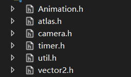
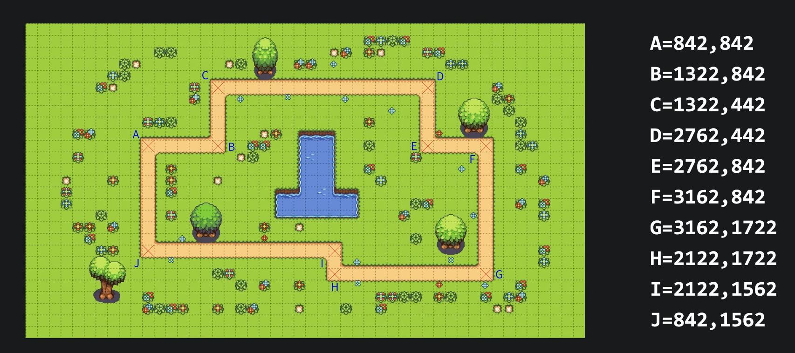
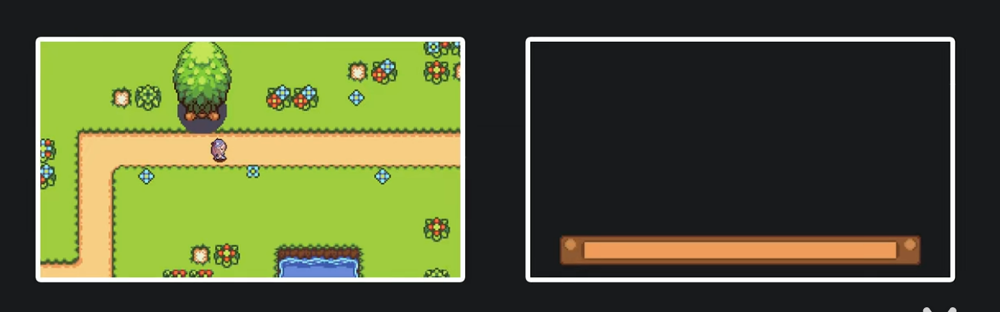

[TOC]

# 项目先导

哈基米大冒险是一款联机打字游戏，教程来自B站Up主Voidmatrix。

链接：【从零开始的C++游戏开发】联机初体验！从零开始速成C++联机游戏开发！| EasyX制作哈基米大冒险】 https://www.bilibili.com/video/BV1yjsoeREdZ/

玩法上：两位玩家将分别扮演诗歌剧和东海帝王。在曲折的道路上比拼打字手速，先跑完的胜利。

在技术上： 

1. 会讲解如何搭建HTTP服务器，并实现不同客户端之间的数据同步。
2. 同时还会讲解如何使用多线程来优化程序性能以及涉及到的原子操作、互斥锁等线程同步技术。

教程旨在开发联机游戏的原型。

需要注意的是——联机游戏 ≠ 单机游戏 + 网络通信


想要保障高性能的数据传输，低延迟的游戏世界同步，又或者是应对弱网重连或防作弊等更进一步的功能，一个完善的联机游戏框架需要在游戏开发伊始阶段就要精心设计。

 

## 速通联机游戏开发基础与HTTP服务器搭建

理论支持 & 代码

关键词：**游戏联机理论**、**cpp-http**

### 理论基础


如果我们希望在不同玩家的电脑上实时地呈现出同一个游戏世界——那么我们需要”同步“——我们就必须做到让这些设备之间的数据进行”同步“——我们可以简单地理解成为是“世界状态”的拷贝。

如何理解世界状态？可以理解为游戏需要的敌人坐标，玩家坐标等必要的游戏参数。**如果可以同过某种手段确保这些数据能在不同玩家的电脑上保持一致便可实现联机游戏的功能。**

游戏联机中最常见的，是星型拓扑网络结构：


服务器作为世界的权威，众多客户端程序都与这个中心服务器进行连接，从中获取最新的游戏状态数据，然后在本地根据客户端预先设计好的逻辑，将这些内容渲染倒窗口上。

——在这种采用这种网络拓扑结构的联机模式下，**客户端仅处理玩家输入和画面渲染，相当于是介入了网络的显示器和手柄**。**而整个世界的运转逻辑，被拆分到了服务端程序上。**

### 代码实践

本项目中，将使用**cpp-http**这个C++第三方库来帮助我们处理HTTP相关的内容。

这时一个.h文件，我们只需要下载即可。

Github仓库地址：https://github.com/yhirose/cpp-httplib

#### client

```c++
#include "../thirdparty/httplib.h"
int main(int argc, char** argv)
{
	httplib::Client client("localhost:25565");

	httplib::Result result = client.Post("/hello");
	if (!result || result->status != 200)
	{
		std::cout << "Hello Failed!" << std::endl;

		return -1;
	}

	std::cout << result->body << std::endl;

	system("pause");

	return 0;
}
```

#### server

```c++
#include "../thirdparty/httplib.h"

void on_hello(const httplib::Request& req, httplib::Response& res)
{
	std::cout << "Hello From Client!" << std::endl;

	res.set_content("Hello From Server!", "text/plain");
}

int main(int argc, char** argv)
{
	httplib::Server server;
	server.Post("/hello", on_hello);
	server.listen("localhost", 25565);

	return 0;
}
```

http的wiki百科：https://en.wikipedia.org/wiki/HTTP

# 联机数据逻辑需求分析与多线程编程基础

游戏玩法 & 更多联机技术细节

### 玩法设计-需求分析

在动手写代码前，先动脑规划设计的习惯，对于现在和未来从事开发的同学来说是一个极为珍贵的素养。

目标是实现联系打字游戏。


从玩家角度，在这个游戏中需要的是：

1. 玩家操控角色的实时坐标
2. 两位玩家当前的打字速度。

**联机游戏的关键在于世界状态的拷贝。**

**一种在主流游戏引擎里常用的思想就是序列化场景中的游戏对象，将序列化后的数据通过网络传输给其他设备后，在其他设备上反序列化后从而形成其他设备上的游戏对象,从而实现世界内容的复制。**

本项目中考虑设计更简单轻量的数据通信方式。

我们发现，角色游戏坐标与“游戏进度”呈线性关系。所以我们需要同步的只有“游戏进度”这一变量——**也即两位玩家完成的字符数这个int类型的值即可。**

#### 服务端分析

`on_hello`这个函数有可能会在同一时刻被多次访问，由于cpp-httplib使用的是阻塞式的SocketIO，这将会也发一个问题：

​	如果我们在该函数体内部修改一个全局变量的值，**那个全局变量的值是不确定的**——也即多线程编程中最为经典的数据竞争问题。`on_hello`函数体内部因多线程的存在形成了临界区，**如果访问时不加控制就很有可能会出现读写冲突。**

为了避免数据竞争的出现，我们需要互斥锁（mutex lock）——在线程A执行`on_hello`临界区代码前，会使用mutex对象上锁临界区。此时其他进程无法访问临界区。当线程A离开临界区时，则会使用mutex对象解锁临界区。其他线程得以进入临界区。

互斥锁的作用就是保证无论何时何地，临界区内只有一个线程执行代码。

```c++
std::string g_str;
std::mutex g_mutex;	//互斥锁对象
void on_hello(const httplib::Request& req, httplib::Response& res)
{
    g_mutex.lock();	//进入临界区前上锁
    
    g_str = req.body;
    
	std::cout << "Hello From Client!" << std::endl;

	res.set_content("Hello From Server!", "text/plain");
    
    g_mutex.unlock(); //出临界区后解锁
}

int main(int argc, char** argv)
{
	httplib::Server server;
	server.Post("/hello", on_hello);
	server.listen("localhost", 25565);

	return 0;
}
```

互斥锁使用不当有可能会造成死锁——比如忘记解锁mutex。

幸运的时，STL为我们提供了智能的mutex模板类以防止忘记解锁mutex—— `std::lock_guard`

```
std::string g_str;
std::mutex g_mutex;	//互斥锁对象
void on_hello(const httplib::Request& req, httplib::Response& res)
{
 	std::lock_guard<std::mutex> lock(g_mutex);
    g_str = req.body;
    
	std::cout << "Hello From Client!" << std::endl;

	res.set_content("Hello From Server!", "text/plain");
    
}

```

当`on_hello`函数开始执行的时候，使用全局锁g_mutex构造了lock，其构造函数会自动调用`g_mutex.lock()`自动上锁

当`on_hello`函数返回时，lock对象会被销毁，其析构函数将会调用`g_mutex.unlock()`自动解锁。

从而避免了因人为遗忘而产生的死锁问题。

# 游戏服务器设计与客户端基础架构搭建

服务端程序更像是个转发器。游戏中玩家存在三个状态——未登入、已登入和游戏进行中三个状态。

## 服务端程序开发

这是程序头

```
#include "../thirdparty/httplib.h"

#include <mutex>
#include <string>
#include <fstream>
std::mutex g_mutex;			// 全局互斥锁
std::string str_text;		// 文本内容
int progress_1 = -1;		// 玩家1进度
int progress_2 = -1;		// 玩家2进度
```

根据玩法设计，我们首先需要读取预设好的文本数据

```c++
int main(int argc, char** argv)
{
    /*读入文本内容*/
    std::ifstream file("text.txt");

    if (!file.good())
    {
        MessageBox(nullptr, L"无法打开文件 text.txt", L"启动失败", MB_OK | MB_ICONERROR);
        return -1;
    }

    std::stringstream str_stream;
    str_stream << file.rdbuf();
    str_text = str_stream.str();

    file.close();
    
    ......
}
```

接下来是通讯部分，首先初始化httplib里提供的服务器对象：

```c++
httplib::Server server;
```

负责响应用户登入请求：

```C++
/* 用户登入 */
server.Post("/login", [&](const httplib::Request& req, httplib::Response& res) {

	std::lock_guard<std::mutex> lock(g_mutex);
	// 多余用户登入返回-1并忽略
	if (progress_1 >= 0 && progress_2 >= 0)
	{
        // "text/plain" 是 HTTP 协议中表示“纯文本内容”的标准标识。
		res.set_content("-1", "text/plain");	
		return;
	}

	// 返回登入的id
	res.set_content(progress_1 >= 0 ? "2" : "1", "text/plain");
	// 用户登入标识
	if (progress_1 >= 0) {
		progress_2 = 0;
	}
	else {
		progress_1 = 0;
	}
});
```

返回游戏所需的文本文件：

```c++
/*返回游戏所需的文本文件*/
server.Post("/query_text", [&](const httplib::Request& req, httplib::Response& res) {
	res.set_content(str_text, "text/plain");
});
```

最后是最重要的同步部分代码——完成世界状态的同步：

```c++
/*世界状态的同步*/
server.Post("/update_1", [&](const httplib::Request& req, httplib::Response& res) {
    std::lock_guard<std::mutex> lock(g_mutex);

    // 玩家1客户端返回当前用户的打字数，服务端将其保存在本地变量progress_1中
    progress_1 = std::stoi(req.body);
    // 在响应体中告知玩家2当前的进度，从而实现世界状态的复制。
    res.set_content(std::to_string(progress_2), "text/plain");
    });

server.Post("/update_2", [&](const httplib::Request& req, httplib::Response& res) {
    std::lock_guard<std::mutex> lock(g_mutex);
	// 玩家2客户端返回当前用户的打字数，服务端将其保存在本地变量progress_2中
    progress_2 = std::stoi(req.body);
 	// 在响应体中告知玩家1当前的进度，从而实现世界状态的复制。
    res.set_content(std::to_string(progress_1), "text/plain");
});
```

设置服务器监听端口
```c++
server.listen("0.0.0.0", 25565);
/*
0.0.0.0是一个特殊的IP地址，表示“所有可用的网络接口”。
当一个网络服务监听在 0.0.0.0 上时，它可以接受来自任何网络接口上的连接。
通常用于服务器配置，以允许服务接受所有网络接口上的连接请求。
*/
```

## 客户端基础架构搭建

基础框架就是voidmatrix前几期讲的几个复用代码：



* `Animation.h`这个头文件里实现了动画播放器
* `atlas.h` 这个实现了图集，方便图像资源的管理
* `camera.h`这个实现了摄像系统
* `timer.h`这个实现了计时器系统
* `util.h`这个则是工具类
* `vector2.h`这个是游戏开发经常用到的二维向量类

# 玩家路径查询与帧间平滑插值移动

按照游戏玩法，每当我们敲下正确的字符，游戏角色就会向前平移一段距离。如果我们不进行**平滑处理**，角色的移动将会在一瞬间完成。游戏画面上会带来一顿一顿的观感。在游戏开发中，平滑处理显得尤为重要。

如何平滑？从起始帧，平滑的向着目标位置移动，而这个移动的过程可能会跨越多个渲染帧。

## Path类的设计

玩家地图如下图所示，右边是构成路径顶点的坐标。我们首先应该要做的是，在给定任意游戏进度（打字文本完成度）的情况下，都能得到地图上对应的坐标位置——也就是说要完成游戏进度到地图坐标的映射。




Path类的作用是给定游戏进度得出坐标位置。具体看代码：

```cpp
class Path
{
public:
	Path(const std::vector<Vector2>& point_list)
	{
		this->point_list = point_list;

		for (size_t i = 1; i < point_list.size(); ++i)
		{
			float segment_len =
                (point_list[i] - point_list[i - 1]).length();
			segment_len_list.push_back(segment_len);
			total_length += segment_len;
		}

	}
	~Path() = default;
	Vector2 get_position_at_progress(float progress) const
	{
        /*边界条件判断*/
		if (progress <= 0) return point_list.front();
		if (progress >= 1) return point_list.back();

		float target_distance = total_length * progress;

		float accumulated_len = 0.0f;
		for (size_t i = 1; i < point_list.size(); ++i)
		{
			accumulated_len += segment_len_list[i - 1];
			if (accumulated_len >= target_distance)
			{
				float segment_progress = 
                    (target_distance - (accumulated_len - segment_len_list[i - 1])) 
                    		/ segment_len_list[i - 1];
				
				return point_list[i - 1] + 
                    (point_list[i] - point_list[i - 1]) * segment_progress;
			}
		}

		return point_list.back(); 
	}

private:
	float total_length = 0;
	std::vector<Vector2> point_list;
	std::vector<float> segment_len_list;
};
```

构造函数的作用是读取节点坐标，并计算各段路的长度和总长度。

在`get_position_at_progress(float progress)`这个函数里，将会根据游戏进度得出坐标位置。

## Player类与平滑

Player类的整体框架如下所示

```c++
class Player{
public:
	/* 枚举正面朝向 */
	enum class Facing
	{
		Up, Down, Left, Right
	};
public:
    Player(Atlas* atlas_idle_up, Atlas* atlas_idle_down, 
           Atlas* atlas_idle_left, Atlas* atlas_idle_right,
			Atlas* atlas_run_up, Atlas* atlas_run_down, 
           Atlas* atlas_run_left, Atlas* atlas_run_right);
    ~Player() = default;
    void on_update(float delta);
    void on_render(const Camera& camera);
	void set_position(const Vector2& position);
    const Vector2& get_position();
    void set_target(const Vector2& pos_target);
    
private:
	const float SPEED_RUN = 100.0f;
private:
	Vector2 position;
	Vector2 velocity;
	Vector2 pos_target;

	Animation anim_idle_up;
	Animation anim_idle_down;
	Animation anim_idle_left;
	Animation anim_idle_right;

	Animation anim_run_up;
	Animation anim_run_down;
	Animation anim_run_left;
	Animation anim_run_right;

	Animation* current_anim = nullptr;

	Facing facing = Facing::Down;
    
}
```

其中：

构造函数负责初始化玩家类的动画资源：

 ```c++
 Player(Atlas* atlas_idle_up, Atlas* atlas_idle_down, Atlas* atlas_idle_left, Atlas* atlas_idle_right,
 	Atlas* atlas_run_up, Atlas* atlas_run_down, Atlas* atlas_run_left, Atlas* atlas_run_right)
 {
 	anim_idle_up.set_loop(true);
 	anim_idle_up.set_interval(0.1f);
 	anim_idle_up.add_frame(atlas_idle_up);
 
 	anim_idle_down.set_loop(true);
 	anim_idle_down.set_interval(0.1f);
 	anim_idle_down.add_frame(atlas_idle_down);
 
 	anim_idle_left.set_loop(true);
 	anim_idle_left.set_interval(0.1f);
 	anim_idle_left.add_frame(atlas_idle_left);
 
 	anim_idle_right.set_loop(true);
 	anim_idle_right.set_interval(0.1f);
 	anim_idle_right.add_frame(atlas_idle_right);
 
 
 	anim_run_up.set_loop(true);
 	anim_run_up.set_interval(0.1f);
 	anim_run_up.add_frame(atlas_run_up);
 
 	anim_run_down.set_loop(true);
 	anim_run_down.set_interval(0.1f);
 	anim_run_down.add_frame(atlas_run_down);
 
 	anim_run_left.set_loop(true);
 	anim_run_left.set_interval(0.1f);
 	anim_run_left.add_frame(atlas_run_left);
 
 	anim_run_right.set_loop(true);
 	anim_run_right.set_interval(0.1f);
 	anim_run_right.add_frame(atlas_run_right);
 }
 ```

`on_update`则是负责玩家动画更新逻辑，是“重头戏”

```c++
void on_update(float delta)
{
	/* 玩家位置是否在目标位置处？ */
	if (!position.approx(pos_target))
		velocity = (pos_target - position).normalize() * SPEED_RUN;
	else
		velocity = Vector2(0, 0);
	
	/* 是否能超过目标位置 */
	if ((pos_target - position).length() <= (velocity * delta).length())
		position = pos_target;
	else
		position += velocity * delta;

	if (velocity.approx(Vector2(0, 0)))
	{
		/*速度为零时的动画*/
		switch (facing)
		{
		case Player::Facing::Up:	current_anim = &anim_idle_up;		 break;
		case Player::Facing::Down:	current_anim = &anim_idle_down;		 break;
		case Player::Facing::Left:	current_anim = &anim_idle_left;		 break;
		case Player::Facing::Right:	current_anim = &anim_idle_right;	 break;
		}
	}
	else
	{
		if (abs(velocity.y) >= 0.0001f)
			facing = (velocity.y > 0) ? Player::Facing::Down : Player::Facing::Up;
		if (abs(velocity.x) >= 0.0001f)
			facing = (velocity.x > 0) ? Player::Facing::Left : Player::Facing::Right;

		switch (facing)
		{
		case Player::Facing::Up:	current_anim = &anim_run_up;		 break;
		case Player::Facing::Down:	current_anim = &anim_run_down;		 break;
		case Player::Facing::Left:	current_anim = &anim_run_left;		 break;
		case Player::Facing::Right:	current_anim = &anim_run_right;		 break;
		}
	}

	if (!current_anim) return;
	current_anim->set_position(position);
	current_anim->on_update(delta);
}
```

其中代码段

```c++
	/* 玩家位置是否在目标位置处？ */
	if (!position.approx(pos_target))
		velocity = (pos_target - position).normalize() * SPEED_RUN;
	else
		velocity = Vector2(0, 0);
	
	/* 是否能超过目标位置 */
	if ((pos_target - position).length() <= (velocity * delta).length())
		position = pos_target;
	else
		position += velocity * delta;		// 平滑
```

负责平滑操作。其原理在于将瞬间的移动分割成多帧进行。（问题，如果手速过快怎么办？答，再快每帧也只接收一个输入……）

`on_render`函数负责渲染操作具体原理需要见voidmatrix前几期视频，代码如下：

```c++
void on_render(const Camera& camera)
{
	if (!current_anim) return;
	current_anim->on_render(camera);
}
```

剩下几个函数不再展开讨论。

```c++
void set_position(const Vector2& position)
{
	this->position = position;
}

const Vector2& get_position() const
{
	return position;
}

void set_target(const Vector2& pos_target)
{
	this->pos_target = pos_target;
}
```

至此，完成了客户端基本框架的搭建。

# 多线程网络通信与联机客户端开发

让我们完成《哈基米大冒险！》的收尾工作。

以下是全局变量们，由于游戏体量较小，所以全局变量较多。

```c++
// 游戏状态
enum class Stage
{
	Waiting,		// 等待玩家加入
	Ready,			// 准备起跑倒计时
	Racing			// 正在比赛中
};

int val_count_down = 4;				// 起跑倒计时
Stage stage = Stage::Waiting;		// 当前游戏状态

int id_player = 0;					// 玩家序号
/*
atomic 原子操作——将变量的读写变为不可分割的原子操作
*/
std::atomic<int> progress_1 = -1;	// 玩家1进度
std::atomic<int> progress_2 = -1;	// 玩家2进度
int num_total_char = 0;				// 全部字符数

Path path = Path(
	{
		{842, 842}, {1322, 842}, {1322, 442},
		{2762, 442}, {2762, 842}, {3162, 842},
		{3162, 1722}, {2122, 1722},{2122, 1562},
		{842, 1562}, {842, 842}
	}
); // 角色移动路径对象

int idx_line = 0;						// 当前文本行索引
int idx_char = 0;						// 当前文本字符索引
std::string str_text;					// 文本内容
std::vector<std::string> str_line_list;	// 行文本内容


//玩家图集
Atlas atlas_1p_idle_up;
Atlas atlas_1p_idle_down;
Atlas atlas_1p_idle_left;
Atlas atlas_1p_idle_right;

Atlas atlas_1p_run_up;
Atlas atlas_1p_run_down;
Atlas atlas_1p_run_left;
Atlas atlas_1p_run_right;

Atlas atlas_2p_idle_up;
Atlas atlas_2p_idle_down;
Atlas atlas_2p_idle_left;
Atlas atlas_2p_idle_right;

Atlas atlas_2p_run_up;
Atlas atlas_2p_run_down;
Atlas atlas_2p_run_left;
Atlas atlas_2p_run_right;

IMAGE img_ui_1;				// 界面文本1
IMAGE img_ui_2;				// 界面文本2
IMAGE img_ui_3;				// 界面文本3
IMAGE img_ui_fight;			// 界面文本FIGHT
IMAGE img_ui_textbox;		// 界面文本框
IMAGE img_background;		// 背景图

std::string str_address;			// 服务器地址
httplib::Client* client = nullptr;	// HTTP服务端对象
```

接下来是资源加载函数`load_resources`，没啥看头：

```cpp
void load_resources(HWND hwnd)
{
	// 字体资源
	AddFontResourceEx(_T("resources/IPix.ttf"), FR_PRIVATE, NULL);
	// 图集资源
	atlas_1p_idle_up.load    (_T("resources/hajimi_idle_back_%d.png"), 4);
	atlas_1p_idle_down.load  (_T("resources/hajimi_idle_front_%d.png"), 4);
	atlas_1p_idle_left.load  (_T("resources/hajimi_idle_left_%d.png"), 4);
	atlas_1p_idle_right.load (_T("resources/hajimi_idle_right_%d.png"), 4);

	atlas_1p_run_up.load     (_T("resources/hajimi_run_back_%d.png"), 4);
	atlas_1p_run_down.load   (_T("resources/hajimi_run_front_%d.png"), 4);
	atlas_1p_run_left.load   (_T("resources/hajimi_run_left_%d.png"), 4);
	atlas_1p_run_right.load  (_T("resources/hajimi_run_right_%d.png"), 4);

	atlas_2p_idle_up.load    (_T("resources/manbo_idle_back_%d.png"), 4);
	atlas_2p_idle_down.load  (_T("resources/manbo_idle_front_%d.png"), 4);
	atlas_2p_idle_left.load  (_T("resources/manbo_idle_left_%d.png"), 4);
	atlas_2p_idle_right.load (_T("resources/manbo_idle_right_%d.png"), 4);

	atlas_2p_run_up.load     (_T("resources/manbo_run_back_%d.png"), 4);
	atlas_2p_run_down.load   (_T("resources/manbo_run_front_%d.png"), 4);
	atlas_2p_run_left.load   (_T("resources/manbo_run_left_%d.png"), 4);
	atlas_2p_run_right.load  (_T("resources/manbo_run_right_%d.png"), 4);

	// 单独的图片素材
	loadimage(&img_ui_1, _T("resources/ui_1.png"));
	loadimage(&img_ui_2, _T("resources/ui_2.png"));
	loadimage(&img_ui_3, _T("resources/ui_3.png"));
	loadimage(&img_ui_fight, _T("resources/ui_fight.png"));
	loadimage(&img_ui_textbox, _T("resources/ui_textbox.png"));
	loadimage(&img_background, _T("resources/background.png"));

	//音频资源的加载
	load_audio(_T("resources/bgm.mp3"), _T("bgm"));
	load_audio(_T("resources/1p_win.mp3"), _T("1p_win"));
	load_audio(_T("resources/2p_win.mp3"), _T("2p_win"));
	load_audio(_T("resources/click_1.mp3"), _T("click_1"));
	load_audio(_T("resources/click_2.mp3"), _T("click_2"));
	load_audio(_T("resources/click_3.mp3"), _T("click_3"));
	load_audio(_T("resources/click_4.mp3"), _T("click_4"));
	load_audio(_T("resources/ui_1.mp3"), _T("ui_1"));
	load_audio(_T("resources/ui_2.mp3"), _T("ui_2"));
	load_audio(_T("resources/ui_3.mp3"), _T("ui_3"));
	load_audio(_T("resources/ui_fright.mp3"), _T("ui_fright"));

	std::ifstream file("config.cfg");

	if (!file.good())
	{
		MessageBox(hwnd, L"无法打开配置 config.cfg", L"启动失败", MB_OK | MB_ICONERROR);
		exit(-1);
	}

	std::stringstream str_stream;
	str_stream << file.rdbuf();
	str_address = str_stream.str();	// 读取配置的网络地址

	file.close();
}
```

重头戏来了，`login_to_server`。该函数将会建立服务器连接并每隔一段时间向服务器交换一次数据。

看代码：

```c++
void login_to_server(HWND hwnd)
{
	client = new httplib::Client(str_address);
	client->set_keep_alive(true); // 不断开底层TCP连接
	httplib::Result result = client->Post("/login");
	if (!result || result->status != 200)
	{
		MessageBox(hwnd, _T("无法连接服务器！"), _T("启动失败"), MB_OK | MB_ICONERROR);
		exit(-1);
	}
	id_player = std::stoi(result->body);
	if (id_player <= 0)
	{
		MessageBox(hwnd, _T("比赛已经开始了！"), _T("拒绝加入"), MB_OK | MB_ICONERROR);
		exit(-1);
	}
    // 设置玩家id
	(id_player == 1) ? (progress_1 = 0) : (progress_2 = 0);
	...
}
```

这段代码初始化httplib里的client对象并向服务器发送`/login`请求。之后会得到服务器返回的玩家id。

如果无法连接服务器，那么将通过弹窗告知并结束程序。

如果从服务器返回的玩家id小于或等于0，则表明房间已满，退出程序。

如果以上两点均满足，则设置玩家id。

接下来是向服务器请求游戏文本，同时将游戏文本分割成行存储在数组中。

```c++
void login_to_server(HWND hwnd)
{
	...

	str_text = client->Post("/query_text")->body;
	// 按行分割字符串
	std::stringstream str_stream(str_text);
	std::string str_line;
	while (std::getline(str_stream, str_line))
	{
		str_line_list.push_back(str_line);
		num_total_char += (int)str_line.length();
	}
	...
}
```

接下来是数据同步进程：

```c++
void login_to_server(HWND hwnd)
{
	...
	// 数据同步线程
	std::thread([&]() {
			while (true)
			{
				using namespace std::chrono;
				std::string route = (id_player == 1) ? "/update_1" : "/update_2";
				std::string body = std::to_string((id_player == 1) ? progress_1 : progress_2);
				httplib::Result result = client->Post(route, body, "text/plain");

				if (result && result->status == 200)
				{
					int progress = std::stoi(result->body);
					(id_player == 1) ? (progress_2 = progress) : (progress_1 = progress);
				}

				std::this_thread::sleep_for(nanoseconds(1000000000 / 10));
			}
		}
	).detach();//分离后，线程将与我们主线程并行执行
}
```

该部分代码将会创建一个线程，定期与服务器交换数据。从而完成世界状态的同步。同步的时间，可以看做是”网络帧“的帧间隔。

最后detach（）将会将该线程与主线程分离。

## main函数与游戏逻辑

### 处理数据初始化部分

```c++
int main(int argc, char** argv)
{
	
	using namespace std::chrono;

	HWND hwnd = initgraph(1280, 720/*, EW_ShOWCONSOLE*/);
	SetWindowText(hwnd, _T("哈基米大冒险！@voidmatrix"));
	settextstyle(28, 0, _T("Ipix"));

	setbkmode(TRANSPARENT);	// Set background mode - TRANSPARENT

	load_resources(hwnd);
	login_to_server(hwnd);
	/////////////// 处理数据初始化 ///////////////
	ExMessage msg;
	Timer timer_countdown;

/*
	界面中的文本框使用camera_ui进行渲染
	跟随玩家移动的视野使用camera_scene渲染
*/
	Camera camera_ui, camera_scene;

	Player player_1(

		&atlas_1p_idle_up,
		&atlas_1p_idle_down,
		&atlas_1p_idle_left,
		&atlas_1p_idle_right,

		&atlas_1p_run_up,
		&atlas_1p_run_down,
		&atlas_1p_run_left,
		&atlas_1p_run_right
		);
	Player player_2(

		&atlas_2p_idle_up,
		&atlas_2p_idle_down,
		&atlas_2p_idle_left,
		&atlas_2p_idle_right,

		&atlas_2p_run_up,
		&atlas_2p_run_down,
		&atlas_2p_run_left,
		&atlas_2p_run_right
	);		   

	camera_ui.set_size({ 1280, 720 });
	camera_scene.set_size({ 1280, 720 });

	player_1.set_position({ 842, 842 });
	player_1.set_position({ 842, 842 });

	// 初始化计时器
	timer_countdown.set_one_shot(false);
	timer_countdown.set_wait_time(1.0f);
	timer_countdown.set_on_timeout([&]()
		{
			val_count_down--;

			switch (val_count_down)
			{
			case 3: play_audio(_T("ui_3"));		break;
			case 2: play_audio(_T("ui_2"));		break;
			case 1: play_audio(_T("ui_1"));		break;
			case 0: play_audio(_T("ui_fight"));	break;
			case -1:
				stage = Stage::Racing;
				play_audio(_T("bgm"), true);
				break;
			}
		});
	// 控制帧率
	const nanoseconds frame_duration(1000000000 / 144);
	steady_clock::time_point last_tick = steady_clock::now();

	BeginBatchDraw();

	...
	return 0;
}
```

接下来是游戏主循环部分,框架如下：

```c++
while(ture)
{
    /////////////// 处理玩家输入 ///////////////
    
    /////////////// 处理游戏更新 ///////////////
    
    /////////////// 处理画面绘制 ///////////////
    
    FlushBatchDraw();
    // 控制帧率
    last_tick = frame_start;
    nanoseconds sleep_duration = frame_duration- (steady_clock::now() - frame_start);
    if (sleep_duration > nanoseconds(0))
    std::this_thread::sleep_for(sleep_duration);


}
```

在处理玩家输入部分，我们将检查玩家输入的字符是否正确，如果正确，则增加游戏进度。

```c++
/////////////// 处理玩家输入 ///////////////
while (peekmessage(&msg))
{
    //如果不是游戏中，直接跳过
    if (stage != Stage::Racing)
        continue;

    if (msg.message == WM_CHAR && idx_line < str_line_list.size())
    {
        const std::string& str_line = str_line_list[idx_line];
        if (str_line[idx_char] == msg.ch)
        {
            switch (rand() % 4)
            {
                case 0: play_audio(_T("click_1")); break;
                case 1: play_audio(_T("click_2")); break;
                case 2: play_audio(_T("click_3")); break;
                case 3: play_audio(_T("click_4")); break;
            }

            (id_player == 1) ? progress_1++ : progress_2++;
            idx_char++;
            if (idx_char >= str_line.length())
            {
                idx_char = 0;
                idx_line++;
            }
        }
    }
}
```

在处理游戏逻辑更新部分中，我们设置了游戏输赢判断标准，编写了根据游戏进度（progress）来更新玩家和摄像机的位置：

```c++
/////////////// 处理游戏更新 ///////////////

steady_clock::time_point frame_start = steady_clock::now();
duration<float> delta = duration<float>(frame_start - last_tick);

if (stage == Stage::Waiting)
{
	if (progress_1 >= 0 && progress_2 >= 0)
	{
		stage = Stage::Ready;
	}

}
else
{
	if (stage == Stage::Ready)
		timer_countdown.on_update(delta.count());

	if ((id_player == 1 && progress_1 >= num_total_char) || (id_player == 2 && progress_2 >= num_total_char))
	{
		stop_audio(_T("bgm"));
		play_audio((id_player == 1) ? _T("1p_win") : _T("2p_win"));
		MessageBox(hwnd, _T("赢麻麻~"), _T("游戏结束"), MB_OK | MB_ICONINFORMATION);
		exit(0);
	}
	else if ((id_player == 1 && progress_2 >= num_total_char) || (id_player == 1 && progress_2 >= num_total_char))
	{
		stop_audio(_T("bgm"));
		MessageBox(hwnd, _T("输光光~"), _T("游戏结束"), MB_OK | MB_ICONINFORMATION);
		exit(0);
	}

	player_1.set_target(path.get_position_at_progress((float)progress_1 / num_total_char));
	player_2.set_target(path.get_position_at_progress((float)progress_2 / num_total_char));

	player_1.on_update(delta.count());
	player_2.on_update(delta.count());

	camera_scene.look_at((id_player == 1) ? player_1.get_position() : player_2.get_position());
}
```

值得注意的是，我们使用了两个camera对象，它们分别负责游戏场景和游戏ui的绘制。



最后则是画面渲染部分，请看代码及其注释：

```c++
/////////////// 处理画面绘制 ///////////////
setbkcolor(RGB(0, 0, 0));
cleardevice();
// 开始前界面绘制
if (stage == Stage::Waiting)
{
    settextcolor(RGB(195, 195, 195));
    outtextxy(15, 675, _T("比赛即将开始，等待其他玩家加入......"));
}
// 游戏开始后界面绘制
else
{
    // 绘制背景图
    static const Rect rect_bg =
    {
        0, 0, img_background.getwidth(), img_background.getheight()
    };
    putimage_ex(camera_scene, &img_background, &rect_bg);

    //绘制玩家
    if (player_1.get_position().y > player_2.get_position().y)
    {
        player_2.on_render(camera_scene);	//先画玩家2
        player_1.on_render(camera_scene);	//再画玩家1
    }
    else
    {
        player_1.on_render(camera_scene);	//先画玩家1
        player_2.on_render(camera_scene);	//再画玩家2
    }

    // 绘制倒计时
    switch (val_count_down)
    {
        case 3:
            {
                static const Rect rect_ui_3 = {
                    1280 / 2 - img_ui_3.getwidth() / 2,
                    720 / 2 - img_ui_3.getheight() / 2,
                    img_ui_3.getwidth(), img_ui_3.getheight()
                };
                putimage_ex(camera_ui, &img_ui_3, &rect_ui_3);
                break;
            }
        case 2:
            {
                static const Rect rect_ui_2 = {
                    1280 / 2 - img_ui_2.getwidth() / 2,
                    720 / 2 - img_ui_2.getheight() / 2,
                    img_ui_2.getwidth(), img_ui_2.getheight()
                };
                putimage_ex(camera_ui, &img_ui_2, &rect_ui_2);
                break;
            }
        case 1:
            {
                static const Rect rect_ui_1 = {
                    1280 / 2 - img_ui_1.getwidth() / 2,
                    720 / 2 - img_ui_1.getheight() / 2,
                    img_ui_1.getwidth(), img_ui_1.getheight()
                };
                putimage_ex(camera_ui, &img_ui_1, &rect_ui_1);
                break;
            }
        case 0:
            {
                static const Rect rect_ui_fight = {
                    1280 / 2 - img_ui_fight.getwidth() / 2,
                    720 / 2 - img_ui_fight.getheight() / 2,
                    img_ui_fight.getwidth(), img_ui_fight.getheight()
                };
                putimage_ex(camera_ui, &img_ui_3, &rect_ui_fight);
                break;
            }
        default:
            break;
    }

    // 绘制界面
    if (stage == Stage::Racing)
    {
        static const Rect rect_textbox =
        {
            0, 
            720 - img_ui_textbox.getheight(), 
            img_ui_textbox.getwidth(), 
            img_ui_textbox.getheight()
        };

        /* EasyX中使用的是宽字符字符串，而网络传输而来的字符串是utf-8编码并使用string存储的,
				   所以这里需要用convert对象进行字符串的编码转换。
				*/
        static std::wstring_convert<std::codecvt_utf8<wchar_t>, wchar_t> convert;
        std::wstring wstr_line = convert.from_bytes(str_line_list[idx_line]);
        std::wstring wstr_completed = convert.from_bytes(str_line_list[idx_line].substr(0, idx_char));

        putimage_ex(camera_ui, &img_ui_textbox, &rect_textbox);

        // 构造视觉上多层次的字体
        settextcolor(RGB(125, 125, 125));
        outtextxy(185 + 2, rect_textbox.y + 65 + 2, wstr_line.c_str());
        settextcolor(RGB(25,25,25));
        outtextxy(185, rect_textbox.y + 65, wstr_line.c_str());
        settextcolor(RGB(0, 149, 217));
        outtextxy(185, rect_textbox.y + 65, wstr_completed.c_str());
    }
}
```

# 拓展方向


# Q & A

什么是阻塞式 Socket.IO 以下是DeepSeek带来的答案：

> ### **1. 核心概念**
>
> - **阻塞式**：线程在调用 Socket.IO 的方法（如 `emit()` 发送消息或监听事件）时会被挂起，直到操作完成。
>
>   javascript
>
>   ```javascript
>   // 伪代码示例：假设存在一个阻塞的 send 方法
>   socket.blockingEmit('message', data); // 线程在此等待发送完成
>   console.log('消息发送完毕'); // 只有在发送完成后才会执行
>   ```
>
> - **非阻塞式**：操作立即返回，通过回调、Promise 或事件通知结果。
>
>   javascript
>
>   ```javascript
>   // 实际 Socket.IO 的异步用法
>   socket.emit('message', data, () => {
>     console.log('消息已确认送达');
>   });
>   console.log('继续执行其他代码'); // 无需等待发送完成
>   ```
>
> ------
>
> ### **2. Socket.IO 的默认行为**
>
> - 
>
>   Socket.IO 本身是异步的
>
>   。例如：
>
>   - `emit()` 发送消息后立即继续执行，通过回调处理确认。
>   - 监听事件（`on()`）通过异步事件驱动模型处理数据。
>
> - **底层依赖**：在浏览器中基于 WebSocket（异步 API），在 Node.js 中基于 EventEmitter 和异步 I/O。
>
> ------
>
> ### **3. 阻塞式场景的可能性**
>
> 虽然 Socket.IO 设计为异步，但在以下情况可能引发“类似阻塞”的行为：
>
> - 
>
>   同步代码占用主线程
>
>   ：
>
>   javascript
>
>   ```javascript
>   // 在浏览器中，长时间同步操作会阻塞所有 Socket.IO 事件
>   socket.on('data', (data) => {
>     heavySynchronousProcessing(data); // 阻塞主线程
>   });
>   ```
>
> - 
>
>   Node.js 中误用同步 API
>
>   ：
>
>   javascript
>
>   ```javascript
>   // 错误示例：在异步函数中使用同步文件操作
>   socket.on('event', async () => {
>     const content = fs.readFileSync('large_file.txt'); // 阻塞事件循环
>     socket.emit('response', content);
>   });
>   ```
>
> ------
>
> ### **4. 不同语言实现的差异**
>
> - **JavaScript（Node.js/浏览器）**：天生异步，需避免同步操作。
> - **Python/Java 等**：如果在多线程中使用阻塞式 Socket.IO 库，可能仅阻塞当前线程，而非整个进程。
>
> ------
>
> ### **5. 如何避免意外阻塞**
>
> - 
>
>   Node.js
>
>   ：
>
>   - 使用 `async/await` 或 `Promise` 处理 I/O。
>   - 拆分 CPU 密集型任务到子进程或 Worker 线程。
>
> - 
>
>   浏览器
>
>   ：
>
>   - 用 Web Workers 处理耗时计算，防止阻塞主线程。
>   - 确保事件监听器中的代码高效。
>
> ------
>
> ### **总结**
>
> Socket.IO 默认是**非阻塞的**，但开发者需注意代码逻辑，避免因同步操作或复杂计算意外阻塞线程。理解异步编程模型（如回调、事件循环）是高效使用 Socket.IO 的关键。

什么是C++中的lambada表达式，以下是以下是DeepSeek带来的答案：

> 嗯，用户问的是C++中的lambda表达式。我需要先回忆一下相关知识，确保自己理解正确。首先，lambda表达式在C++11引入的，对吧？它是用来创建匿名函数对象的，方便在需要函数对象的地方快速定义，比如在算法里作为谓词使用。
>
> 接下来，用户可能已经知道一些基本的函数指针或者函数对象的概念，但可能对lambda的具体语法和用法不太清楚。我需要分步骤解释，先讲基本语法，再讲捕获列表，然后是可变规范和返回类型。
>
> 捕获列表部分可能比较复杂，因为有不同的捕获方式，比如值捕获、引用捕获，还有混合捕获。需要举例子说明每种捕获方式的效果，比如值捕获在lambda创建时拷贝变量，而引用捕获则是引用外部变量，可能导致悬垂引用的问题。
>
> 然后，可变规范mutable关键字，用户可能不理解为什么有时候需要加上这个。应该说明默认情况下lambda的operator()是const的，不能修改捕获的值，除非用mutable，这样operator()就不是const的了，可以修改捕获的副本。
>
> 返回类型部分，可能需要说明自动推导和显式指定的情况。当lambda体中有多个return语句且返回类型相同，可以省略返回类型；否则需要显式指定。
>
> 用户可能还想知道lambda的应用场景，比如在STL算法中的使用，或者作为回调函数。这时候需要举一些实际的例子，比如用sort函数自定义排序规则，或者在多线程中传递任务。
>
> 另外，用户可能会对lambda的性能感兴趣，比如是否比函数对象更高效。需要解释编译器如何内联lambda，通常不会有额外开销，和函数对象类似。
>
> 可能需要注意常见的误区，比如捕获局部变量的引用导致生命周期问题，或者在循环中捕获变量时的陷阱。例如，在循环中捕获引用可能导致所有lambda共享同一个变量，最后得到的是循环结束后的值。
>
> 还有，C++14和C++17对lambda的增强，比如泛型lambda（auto参数）、捕获表达式（初始化捕获），这些可能需要提到，但用户的问题可能集中在基础部分，所以可以简要带过，或者作为扩展内容。
>
> 总结一下，回答的结构应该是：定义、语法、捕获列表、可变规范、返回类型、应用场景、注意事项，可能再加上一些例子。需要确保用简单明了的语言，避免过于技术化的术语，但也要准确。比如，使用示例代码来说明不同的捕获方式，以及它们的效果。
>
> 在解释过程中，可能需要比较lambda和传统的函数对象，说明lambda的优势在于简洁和局部定义，不需要单独写一个函数对象类。同时，注意lambda的类型是唯一的，每个lambda表达式都有不同的类型，所以不能直接用同一个类型声明变量，但可以用auto或者std::function来存储。
>
> 最后，检查是否有遗漏的部分，比如lambda的模板参数在C++20中的支持，但可能用户暂时不需要那么深入的内容。确保回答全面但不过于冗长，重点放在用户可能需要的核心知识点和常见用法上。
>
> 
>
>
> 在 C++ 中，**Lambda 表达式**是一种用于**快速定义匿名函数对象**的特性，自 C++11 标准引入。它允许在代码中直接定义轻量级的、临时的函数逻辑，常用于简化回调、算法谓词（如 `std::sort`、`std::for_each`）等场景。
>
> ---
>
> ### **Lambda 的基本语法**
> Lambda 表达式的通用语法为：
> ```cpp
> [捕获列表](参数列表) mutable(可选) 异常属性(可选) -> 返回类型(可选) {
>     // 函数体
> }
> ```
>
> #### **示例 1：最简单的 Lambda**
> ```cpp
> auto func = []() { 
>     std::cout << "Hello, Lambda!"; 
> };
> func(); // 输出：Hello, Lambda!
> ```
> • `[]`：空捕获列表，表示不捕获外部变量。
> • `()`：无参数。
> • 无返回类型声明（由编译器自动推导）。
>
> ---
>
> ### **关键组成部分解析**
>
> #### **1. 捕获列表（Capture List）**
> Lambda 可以通过捕获列表访问其所在作用域的变量。捕获方式分为：
> • **值捕获**：拷贝外部变量的当前值。
> • **引用捕获**：通过引用访问外部变量（需注意生命周期）。
>
> | 捕获方式           | 语法示例  | 说明                              |
> | ------------------ | --------- | --------------------------------- |
> | 值捕获             | `[x]`     | 捕获变量 `x` 的当前值             |
> | 引用捕获           | `[&x]`    | 通过引用捕获变量 `x`              |
> | 隐式值捕获所有变量 | `[=]`     | 所有外部变量按值捕获              |
> | 隐式引用捕获所有   | `[&]`     | 所有外部变量按引用捕获            |
> | 混合捕获           | `[=, &x]` | 除 `x` 外全部按值捕获，`x` 按引用 |
>
> **示例 2：捕获外部变量**
> ```cpp
> int a = 10, b = 20;
> auto sum = [a, &b]() {
>     return a + b; // a 是值捕获（只读），b 是引用捕获（可修改）
> };
> b = 30;
> std::cout << sum(); // 输出 10 + 30 = 40
> ```
>
> ---
>
> #### **2. `mutable` 关键字**
> 默认情况下，Lambda 的 `operator()` 是 `const` 的，即不能修改按值捕获的变量。使用 `mutable` 可移除 `const` 属性：
> ```cpp
> int cnt = 0;
> auto counter = [cnt]() mutable {
>     cnt++; // 允许修改值捕获的副本（不影响外部的 cnt）
>     return cnt;
> };
> std::cout << counter(); // 输出 1（内部 cnt 是独立的）
> std::cout << cnt;       // 输出 0（外部 cnt 未变）
> ```
>
> ---
>
> #### **3. 返回类型声明**
> 如果函数体包含多个 `return` 语句且返回类型不一致，需显式指定返回类型：
> ```cpp
> auto divide = [](double x, double y) -> double {
>     if (y == 0) return 0; // 返回 int 0，但会被转换为 double
>     return x / y;         // 返回 double
> };
> ```
>
> ---
>
> ### **应用场景**
>
> #### **1. 与 STL 算法结合**
> Lambda 常用于自定义算法的行为：
> ```cpp
> std::vector<int> nums = {3, 1, 4, 1, 5};
> // 按绝对值排序
> std::sort(nums.begin(), nums.end(), [](int a, int b) {
>     return abs(a) < abs(b);
> });
> ```
>
> #### **2. 异步回调**
> 在多线程或异步编程中传递逻辑：
> ```cpp
> #include <thread>
> std::thread t([&]() {
>     std::cout << "Running in a thread!";
> });
> t.join();
> ```
>
> ---
>
> ### **注意事项**
> 1. **生命周期问题**：引用捕获的变量需确保 Lambda 执行时仍有效。
> 2. **性能**：Lambda 通常被编译器优化为内联代码，无额外开销。
> 3. **类型唯一性**：每个 Lambda 的类型唯一，可用 `auto` 或 `std::function` 存储。
>
> ---
>
> ### **C++14/17 增强**
> • **泛型 Lambda**（C++14）：参数可用 `auto`：
>   ```cpp
>   auto print = [](const auto& x) { std::cout << x; };
>   print(42);    // int
>   print("Hi");  // const char*
>   ```
> • **捕获表达式**（C++14）：允许在捕获时初始化变量：
>   ```cpp
>   auto ptr = std::make_unique<int>(10);
>   auto lambda = [p = std::move(ptr)] { return *p; };
>   ```
>
> ---
>
> ### **总结**
> C++ 的 Lambda 表达式通过简洁的语法实现了灵活的函数对象定义，适用于需要临时逻辑的场景（如 STL 算法、回调等）。理解捕获方式、`mutable` 和返回类型是掌握其用法的关键。
