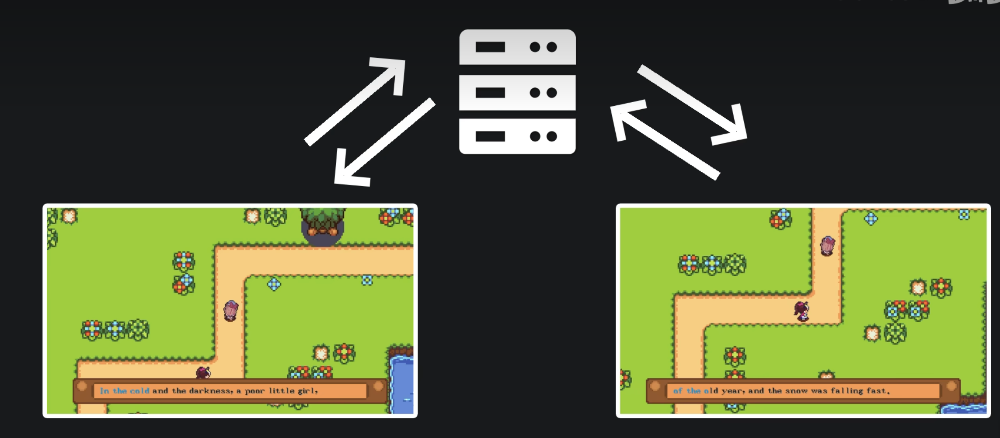
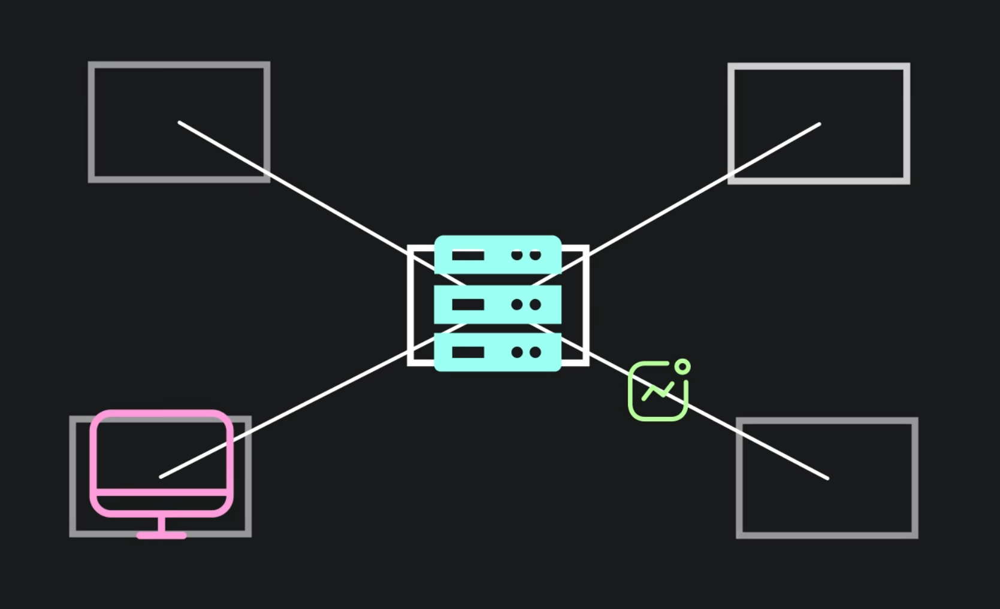

## 项目先导

哈基米大冒险是一款联机打字游戏，教程来自B站Up主Voidmatrix。

链接：【从零开始的C++游戏开发】联机初体验！从零开始速成C++联机游戏开发！| EasyX制作哈基米大冒险】 https://www.bilibili.com/video/BV1yjsoeREdZ/

玩法上：两位玩家将分别扮演诗歌剧和东海帝王。在曲折的道路上比拼打字手速，先跑完的胜利。

在技术上： 

1. 会讲解如何搭建HTTP服务器，并实现不同客户端之间的数据同步。
2. 同时还会讲解如何使用多线程来优化程序性能以及涉及到的原子操作、互斥锁等线程同步技术。

教程旨在开发联机游戏的原型。

需要注意的是——联机游戏 ≠ 单机游戏 + 网络通信


想要保障高性能的数据传输，低延迟的游戏世界同步，又或者是应对弱网重连或防作弊等更进一步的功能，一个完善的联机游戏框架需要在游戏开发伊始阶段就要精心设计。

 

## 速通联机游戏开发基础与HTTP服务器搭建

理论支持 & 代码

关键词：**游戏联机理论**、**cpp-http**

### 理论基础



如果我们希望在不同玩家的电脑上实时地呈现出同一个游戏世界——那么我们需要”同步“——我们就必须做到让这些设备之间的数据进行”同步“——我们可以简单地理解成为是“世界状态”的拷贝。

如何理解世界状态？可以理解为游戏需要的敌人坐标，玩家坐标等必要的游戏参数。**如果可以同过某种手段确保这些数据能在不同玩家的电脑上保持一致便可实现联机游戏的功能。**

游戏联机中最常见的，是星型拓扑网络结构：



服务器作为世界的权威，众多客户端程序都与这个中心服务器进行连接，从中获取最新的游戏状态数据，然后在本地根据客户端预先设计好的逻辑，将这些内容渲染倒窗口上。

——在这种采用这种网络拓扑结构的联机模式下，**客户端仅处理玩家输入和画面渲染，相当于是介入了网络的显示器和手柄**。**而整个世界的运转逻辑，被拆分到了服务端程序上。**

### 代码实践

本项目中，将使用**cpp-http**这个C++第三方库来帮助我们处理HTTP相关的内容。

这时一个.h文件，我们只需要下载即可。

Github仓库地址：https://github.com/yhirose/cpp-httplib

#### client

```c++
#include "../thirdparty/httplib.h"
int main(int argc, char** argv)
{
	httplib::Client client("localhost:25565");

	httplib::Result result = client.Post("/hello");
	if (!result || result->status != 200)
	{
		std::cout << "Hello Failed!" << std::endl;

		return -1;
	}

	std::cout << result->body << std::endl;

	system("pause");

	return 0;
}
```

#### server

```c++
#include "../thirdparty/httplib.h"

void on_hello(const httplib::Request& req, httplib::Response& res)
{
	std::cout << "Hello From Client!" << std::endl;

	res.set_content("Hello From Server!", "text/plain");
}

int main(int argc, char** argv)
{
	httplib::Server server;
	server.Post("/hello", on_hello);
	server.listen("localhost", 25565);

	return 0;
}
```

http的wiki百科：https://en.wikipedia.org/wiki/HTTP

# 联机数据逻辑需求分析与多线程编程基础

游戏玩法 & 更多联机技术细节

### 玩法设计-需求分析

在动手写代码前，先动脑规划设计的习惯，对于现在和未来从事开发的同学来说是一个极为珍贵的素养。

目标是实现联系打字游戏。


从玩家角度，在这个游戏中需要的是：

1. 玩家操控角色的实时坐标
2. 两位玩家当前的打字速度。

**联机游戏的关键在于世界状态的拷贝。**

**一种在主流游戏引擎里常用的思想就是序列化场景中的游戏对象，将序列化后的数据通过网络传输给其他设备后，在其他设备上反序列化后从而形成其他设备上的游戏对象,从而实现世界内容的复制。**

本项目中考虑设计更简单轻量的数据通信方式。

我们发现，角色游戏坐标与“游戏进度”呈线性关系。所以我们需要同步的只有“游戏进度”这一变量——**也即两位玩家完成的字符数这个int类型的值即可。**

#### 服务端分析

`on_hello`这个函数有可能会在同一时刻被多次访问，由于cpp-httplib使用的是阻塞式的SocketIO，这将会也发一个问题：

​	如果我们在该函数体内部修改一个全局变量的值，**那个全局变量的值是不确定的**——也即多线程编程中最为经典的数据竞争问题。`on_hello`函数体内部因多线程的存在形成了临界区，**如果访问时不加控制就很有可能会出现读写冲突。**

为了避免数据竞争的出现，我们需要互斥锁（mutex lock）——在线程A执行`on_hello`临界区代码前，会使用mutex对象上锁临界区。此时其他进程无法访问临界区。当线程A离开临界区时，则会使用mutex对象解锁临界区。其他线程得以进入临界区。

互斥锁的作用就是保证无论何时何地，临界区内只有一个线程执行代码。

```c++
std::string g_str;
std::mutex g_mutex;	//互斥锁对象
void on_hello(const httplib::Request& req, httplib::Response& res)
{
    g_mutex.lock();	//进入临界区前上锁
    
    g_str = req.body;
    
	std::cout << "Hello From Client!" << std::endl;

	res.set_content("Hello From Server!", "text/plain");
    
    g_mutex.unlock(); //出临界区后解锁
}

int main(int argc, char** argv)
{
	httplib::Server server;
	server.Post("/hello", on_hello);
	server.listen("localhost", 25565);

	return 0;
}
```

互斥锁使用不当有可能会造成死锁——比如忘记解锁mutex。

幸运的时，STL为我们提供了智能的mutex模板类以防止忘记解锁mutex—— `std::lock_guard`

```
std::string g_str;
std::mutex g_mutex;	//互斥锁对象
void on_hello(const httplib::Request& req, httplib::Response& res)
{
 	std::lock_guard<std::mutex> lock(g_mutex);
    g_str = req.body;
    
	std::cout << "Hello From Client!" << std::endl;

	res.set_content("Hello From Server!", "text/plain");
    
}

```

当`on_hello`函数开始执行的时候，使用全局锁g_mutex构造了lock，其构造函数会自动调用`g_mutex.lock()`自动上锁

当`on_hello`函数返回时，lock对象会被销毁，其析构函数将会调用`g_mutex.unlock()`自动解锁。

从而避免了因人为遗忘而产生的死锁问题。

# 游戏服务器设计与客户端基础架构搭建

服务端程序更像是个转发器。

## 服务端程序开发


> 什么是阻塞式 Socket.IO 以下是DeepSeek带来的答案：
>
> ### **1. 核心概念**
>
> - **阻塞式**：线程在调用 Socket.IO 的方法（如 `emit()` 发送消息或监听事件）时会被挂起，直到操作完成。
>
>   javascript
>
>   ```javascript
>   // 伪代码示例：假设存在一个阻塞的 send 方法
>   socket.blockingEmit('message', data); // 线程在此等待发送完成
>   console.log('消息发送完毕'); // 只有在发送完成后才会执行
>   ```
>
> - **非阻塞式**：操作立即返回，通过回调、Promise 或事件通知结果。
>
>   javascript
>
>   ```javascript
>   // 实际 Socket.IO 的异步用法
>   socket.emit('message', data, () => {
>     console.log('消息已确认送达');
>   });
>   console.log('继续执行其他代码'); // 无需等待发送完成
>   ```
>
> ------
>
> ### **2. Socket.IO 的默认行为**
>
> - 
>
>   Socket.IO 本身是异步的
>
>   。例如：
>
>   - `emit()` 发送消息后立即继续执行，通过回调处理确认。
>   - 监听事件（`on()`）通过异步事件驱动模型处理数据。
>
> - **底层依赖**：在浏览器中基于 WebSocket（异步 API），在 Node.js 中基于 EventEmitter 和异步 I/O。
>
> ------
>
> ### **3. 阻塞式场景的可能性**
>
> 虽然 Socket.IO 设计为异步，但在以下情况可能引发“类似阻塞”的行为：
>
> - 
>
>   同步代码占用主线程
>
>   ：
>
>   javascript
>
>   ```javascript
>   // 在浏览器中，长时间同步操作会阻塞所有 Socket.IO 事件
>   socket.on('data', (data) => {
>     heavySynchronousProcessing(data); // 阻塞主线程
>   });
>   ```
>
> - 
>
>   Node.js 中误用同步 API
>
>   ：
>
>   javascript
>
>   ```javascript
>   // 错误示例：在异步函数中使用同步文件操作
>   socket.on('event', async () => {
>     const content = fs.readFileSync('large_file.txt'); // 阻塞事件循环
>     socket.emit('response', content);
>   });
>   ```
>
> ------
>
> ### **4. 不同语言实现的差异**
>
> - **JavaScript（Node.js/浏览器）**：天生异步，需避免同步操作。
> - **Python/Java 等**：如果在多线程中使用阻塞式 Socket.IO 库，可能仅阻塞当前线程，而非整个进程。
>
> ------
>
> ### **5. 如何避免意外阻塞**
>
> - 
>
>   Node.js
>
>   ：
>
>   - 使用 `async/await` 或 `Promise` 处理 I/O。
>   - 拆分 CPU 密集型任务到子进程或 Worker 线程。
>
> - 
>
>   浏览器
>
>   ：
>
>   - 用 Web Workers 处理耗时计算，防止阻塞主线程。
>   - 确保事件监听器中的代码高效。
>
> ------
>
> ### **总结**
>
> Socket.IO 默认是**非阻塞的**，但开发者需注意代码逻辑，避免因同步操作或复杂计算意外阻塞线程。理解异步编程模型（如回调、事件循环）是高效使用 Socket.IO 的关键。
