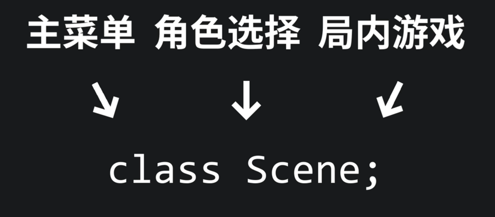
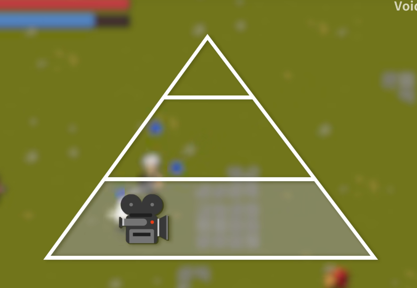
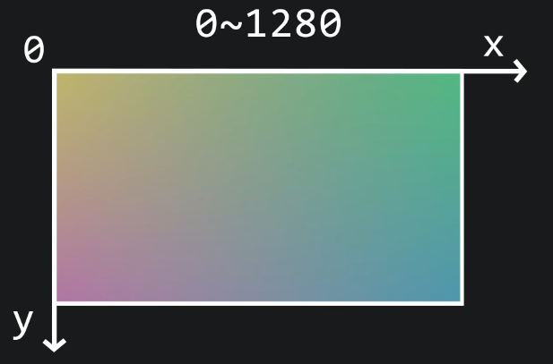

[TOC]

# 导语

《植物明星大乱斗》是一款大乱斗玩法的本地双人游，教程来自B站Up主Voidmatrix。

链接：【从零开始的C++游戏开发】船新版本的植物VS植物大乱斗 | EasyX制作植物明星大乱斗】 https://www.bilibili.com/video/BV1jx4y1t7eP/

本项目中，会引入“场景”这一设计来划分游戏的不同阶段，实现功能间的解耦合。除此之外，还会讲解简单的物理模拟思路，并完成单向碰撞平台的功能。

我们也会封装摄像机、定时器以及粒子系统等在游戏开发领域中热度很高的功能。

# P1 - 场景设计和头文件规则怪谈

### 何为“scene”？

如果我们把游戏程序比作是一场有玩家参与的盛大演出，那么游戏场景(scene)就好比是演出的一幕幕。在不同的幕中，会有不同的“剧本逻辑”，而台上的演员——玩家角色，npc，敌人，甚至是灯光，子弹，一花一木一草——都是游戏对象（GameObject）。

游戏的主菜单是一个场景。

随后的角色选择画面是一个场景

游戏局内的逻辑也需要放置在一个单独的场景中。

故我们可以定义`Scene`这个基类。主菜单，角色选择，局内游戏分别继承自`Scene`这个基类，实现不同的事件处理和绘图逻辑。



### 头文件规则->重复引用。

当我们在源代码文件(以`main.cpp`为例)中引用了一个头文件——例如`A.h`

那么在预处理阶段，编译器就会将`A.h`的内容原封不动的复制到`main.cpp`中。

如果`main.cpp`和`A.h`中都包含了 `B.h`那么就有可能会出现头文件的重复包含从而导致因一些原因（例如重复定义）而编译失败

可以使用以下两种方式避免头文件的重复包含

```c++
#ifndef _A_H_
#define _A_H_
// 代码
#endif
```

Or

```c++
#pragma once
```

---

### scene 基类

```c++
#ifndef _SCENE_H_
#define _SCENE_H_
#include <graphics.h>

class Scene
{
public:
	Scene() = default;
	~Scene() = default;

	virtual void on_enter() { }							// 处理场景进入时的初始化逻辑

	/* 对应游戏主循环框架的三个阶段 */
	virtual void on_input(const ExMessage& msg) { }		// 处理玩家输入时调用
	virtual void on_update() { }						// 处理游戏逻辑更新时调用
	virtual void on_draw() { }							// 画面绘制时调用
	

	virtual void on_exit() { }							// 场景退出时的卸载逻辑

private:

};

#endif // !_SECENE_H_

```

### 主菜单场景类

主菜单场景类继承自Scene基类，负责主菜单场景：

```c++
class MenuScene : public Scene
{
public:
	MenuScene() = default;
	~MenuScene() = default;
	void on_enter() {
		// 进入主菜单
		...
	}

	
	void on_input(const ExMessage& msg) { }		
	void on_update() 
	{ 
		// 主菜单正在运行
		...
	}						
	void on_draw() 
	{
		// 主菜单绘图
		...
	}							


	void on_exit() 
	{
		// 主菜单退出
		...
	}							

};
```

### 游戏场景类

游戏场景类继承自Scene基类，负责游戏场景类

```c++
class GameScene : public Scene
{
	GameScene() = default;
	~GameScene() = default;
	void on_enter() {
		// 进入游戏
        ……
	}

	void on_input(const ExMessage& msg) { }
	void on_update()
	{
		// 游戏逻辑更新
        ……
	}
	void on_draw()
	{
		outtextxy(10, 10, _T("游戏绘图内容"));
	}
	void on_exit()
	{
		// 游戏场景退出
        ……
	}
};
```

游戏角色选择场景类:
```c++
class SelectorScene : public Scene
{
public:
	SelectorScene() = default;
	~SelectorScene() = default;

	void on_input(const ExMessage& msg) { }
	void on_update()
	{
		// 逻辑更新

	}
	void on_draw()
	{
		outtextxy(10, 10, _T("游戏绘图内容"));
	}
	void on_exit()
	{
		// 选择场景退出
	}
private:
};
```


# P2 - 场景管理和图集类实现

游戏程序是个巨大的死循环，也是一个巨大的状态机。

不同的游戏场景代表着不同的状态，而管理这些状态的状态机在游戏开发中有一个特殊的名字——场景管理器。

在上节，我们写了`GameScene`和`MenuScene`两个场景类。

## 场景管理

那么如何进行场景的交换呢？

类比舞台剧，在一幕一幕间，会有一个导演在记录和管理这些切换的动作，在程序中我们称这位导演为“场景管理器”——`SceneManager`

代码如下:

```c++
class SceneManager
{

public:
	enum class SceneType {
		Menu,
		Game
	};
public:
	SceneManager() = default;
	~SceneManager() = default;
	
	void set_current_state(Scene* scene)
	{
		current_scene = scene;
		current_scene->on_enter();
	}
	void switch_to(SceneType type)
	{
		current_scene->on_exit();

		switch (type)
		{
		case SceneType::Menu:
			break;
		case SceneType::Game:
			break;
		default:
			break;
		}

		current_scene->on_enter();
	}
private:
	Scene* current_scene = nullptr;
};
```

`switch_to`函数的作用是切换场景。

> 我们不难看出，`on_enter`函数和`on_exit`函数在功能上和构造函数和析构函数极为相似,都是执行进入和退出的逻辑,那为何不使用构造函数和析构函数而需要额外定义方法呢?
>
> 答:
>
> 首先, 构造函数和析构函数管理的是一个对象在内存中的生命周期. 如果我们不断地切换场景, 那么就需要不断地构造新的对象和释放旧的对象. 
>
> 另外, 场景内对象的生命周期有可能是比场景本身的生命周期长的. 如果使用析构函数进行销毁,那么场景内对象的保留与否是个大问题——这对内存管理提出了更高的要求. 
>
> 所以我们采用了一种更为通用且更家简明的设计思路——场景对象的生命周期与游戏的生命周期相同。
>
> 也就是说，游戏初始化时创建所有场景对象，游戏退出时释放所有场景对象。

之后，我们在`main.cpp`内写下如下代码:

```c++
#include "scene.h"
#include "menu_scene.h"
#include "game_scene.h"
#include "selector_scene.h"
#include "scene_manager.h"

#include <graphics.h>

/* extern关键字定义外部变量 */
extern Scene* menu_scene = nullptr;
extern Scene* game_scene = nullptr;
extern Scene* selector_scene = nullptr;
SceneManager scene_manager;

int main()
{
	ExMessage  msg;
	const int FPS = 60;
	// EW_SHOWCONSOLE 显示控制台。
	initgraph(1280, 720, EW_SHOWCONSOLE);
	BeginBatchDraw();
	//初始化游戏场景
	menu_scene = new MenuScene();
	game_scene = new GameScene();
	selector_scene = new SelectorScene();
	scene_manager.set_current_scene(menu_scene);
	
	while (true)
	{
		DWORD frame_start_time = GetTickCount();
		while (peekmessage(&msg))
		{
			scene_manager.on_input(msg);
		}
		scene_manager.on_update();

		cleardevice();
		scene_manager.on_draw();
		FlushBatchDraw();
		DWORD frame_end_time = GetTickCount();
		DWORD frame_delta_time = frame_end_time - frame_start_time;
		if (frame_delta_time < 1000 / FPS)
			Sleep(1000 / FPS - frame_delta_time);
	}
	EndBatchDraw();
	return 0;
}
```

自此,<植物明星大乱斗>最核心的场景框架就已经搭建完成。

## 图集类

图集类`atlas.h`的作用是方便管理图片资源, 将一系列图片都存到一个图集里方便管理。其代码如下

```c++
#include <vector>
#include <graphics.h>

class Atlas
{
public:
	Atlas() = default;
	~Atlas() = default;
	
	void load(LPCTSTR path_template, int num)
	{
		img_list.clear();
		img_list.resize(num);

		TCHAR path_file[256];

		for (int i = 0; i < num; i++)
		{
			_stprintf_s(path_file, path_template, i + 1);
			loadimage(&img_list[i], path_file);
		}
	}
	void clear()
	{
		img_list.clear();
	}

	int get_size() const
	{
		return (int)img_list.size();
	}

	IMAGE* get_image(int idx)
	{
		if (idx < 0 || idx >= img_list.size())
			return nullptr;

		return &img_list[idx];
	}

	void add_image(const IMAGE& img)
	{
		img_list.push_back(img);
	}
private:
	std::vector<IMAGE> img_list;
};

```

其中`load`函数用来从磁盘加载图片资源，**序号从1到num**。

# P3 - 资源加载和动画类实现

## 工具库util.h

```

```


# P4 - 游戏摄像机基础实现

在游戏开发中，**3C** 指的是 **Character（角色）**、**Camera（相机）** 和 **Control（操作）**，它们是塑造玩家体验的核心三要素。其中 **Camera（相机系统）** 是连接玩家与虚拟世界的“眼睛”，直接影响游戏的沉浸感、操作感和叙事表现。

本节主要讲述2D游戏摄像机的基础实现。游戏摄像机作为整个框架中极为重要的一环，是作为底层的存在。先把这部分内容集成到我们的底层代码中去，然后进行游戏上层主题逻辑的开发。



### 窗口坐标系 与 是世界坐标系


在EasyX中，窗口坐标系的原点在左上角，x轴正方向向右，y轴正方向下下。

如果窗口尺寸为1280 * 720，那么x轴的取值范围为0 ~ 1280，y 轴取值范围为0 ~ 720



世界坐标系的大小随世界大小而定。世界有多大，坐标系的取值范围就有多大。


玩家的移动，碰撞和各类机关道具的触发都是以世界坐标系为基本参考系运行的，而画面的渲染参考的是窗口坐标系——**也即渲染与数据分离**

## 资源加载

这部分代码没啥好说的，一堆硬编码。

```
```

