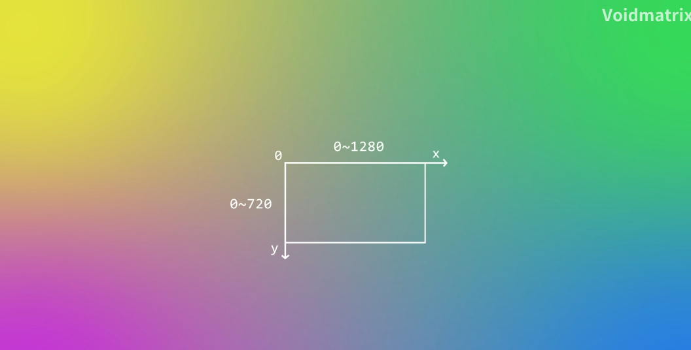

[TOC]

# 导语

《植物明星大乱斗》是一款大乱斗玩法的本地双人游，教程来自B站Up主Voidmatrix。

链接：【从零开始的C++游戏开发】船新版本的植物VS植物大乱斗 | EasyX制作植物明星大乱斗】 https://www.bilibili.com/video/BV1jx4y1t7eP/

本项目中，会引入“场景”这一设计来划分游戏的不同阶段，实现功能间的解耦合。除此之外，还会讲解简单的物理模拟思路，并完成单向碰撞平台的功能。

我们也会封装摄像机、定时器以及粒子系统等在游戏开发领域中热度很高的功能。

# P1 - 场景设计和头文件规则怪谈

### 何为“scene”？

如果我们把游戏程序比作是一场有玩家参与的盛大演出，那么游戏场景(scene)就好比是演出的一幕幕。在不同的幕中，会有不同的“剧本逻辑”，而台上的演员——玩家角色，npc，敌人，甚至是灯光，子弹，一花一木一草——都是游戏对象（GameObject）。

游戏的主菜单是一个场景。

随后的角色选择画面是一个场景

游戏局内的逻辑也需要放置在一个单独的场景中。

故我们可以定义`Scene`这个基类。主菜单，角色选择，局内游戏分别继承自`Scene`这个基类，实现不同的事件处理和绘图逻辑。


### 头文件规则->重复引用。

当我们在源代码文件(以`main.cpp`为例)中引用了一个头文件——例如`A.h`

那么在预处理阶段，编译器就会将`A.h`的内容原封不动的复制到`main.cpp`中。

如果`main.cpp`和`A.h`中都包含了 `B.h`那么就有可能会出现头文件的重复包含从而导致因一些原因（例如重复定义）而编译失败

可以使用以下两种方式避免头文件的重复包含

```c++
#ifndef _A_H_
#define _A_H_
// 代码
#endif
```

Or

```c++
#pragma once
```

---

### scene 基类

```c++
#ifndef _SCENE_H_
#define _SCENE_H_
#include <graphics.h>

class Scene
{
public:
	Scene() = default;
	~Scene() = default;

	virtual void on_enter() { }							// 处理场景进入时的初始化逻辑

	/* 对应游戏主循环框架的三个阶段 */
	virtual void on_input(const ExMessage& msg) { }		// 处理玩家输入时调用
	virtual void on_update() { }						// 处理游戏逻辑更新时调用
	virtual void on_draw() { }							// 画面绘制时调用
	

	virtual void on_exit() { }							// 场景退出时的卸载逻辑

private:

};

#endif // !_SECENE_H_

```

### 主菜单场景类

主菜单场景类继承自Scene基类，负责主菜单场景：

```c++
class MenuScene : public Scene
{
public:
	MenuScene() = default;
	~MenuScene() = default;
	void on_enter() {
		// 进入主菜单
		...
	}

	
	void on_input(const ExMessage& msg) { }		
	void on_update() 
	{ 
		// 主菜单正在运行
		...
	}						
	void on_draw() 
	{
		// 主菜单绘图
		...
	}							


	void on_exit() 
	{
		// 主菜单退出
		...
	}							

};
```

### 游戏场景类

游戏场景类继承自Scene基类，负责游戏场景类

```c++
class GameScene : public Scene
{
	GameScene() = default;
	~GameScene() = default;
	void on_enter() {
		// 进入游戏
        ……
	}

	void on_input(const ExMessage& msg) { }
	void on_update()
	{
		// 游戏逻辑更新
        ……
	}
	void on_draw()
	{
		outtextxy(10, 10, _T("游戏绘图内容"));
	}
	void on_exit()
	{
		// 游戏场景退出
        ……
	}
};
```

游戏角色选择场景类:
```c++
class SelectorScene : public Scene
{
public:
	SelectorScene() = default;
	~SelectorScene() = default;

	void on_input(const ExMessage& msg) { }
	void on_update()
	{
		// 逻辑更新

	}
	void on_draw()
	{
		outtextxy(10, 10, _T("游戏绘图内容"));
	}
	void on_exit()
	{
		// 选择场景退出
	}
private:
};
```


# P2 - 场景管理和图集类实现

游戏程序是个巨大的死循环，也是一个巨大的状态机。

不同的游戏场景代表着不同的状态，而管理这些状态的状态机在游戏开发中有一个特殊的名字——场景管理器。

在上节，我们写了`GameScene`和`MenuScene`两个场景类。

## 场景管理

那么如何进行场景的交换呢？

类比舞台剧，在一幕一幕间，会有一个导演在记录和管理这些切换的动作，在程序中我们称这位导演为“场景管理器”——`SceneManager`

代码如下:

```c++
class SceneManager
{

public:
	enum class SceneType {
		Menu,
		Game
	};
public:
	SceneManager() = default;
	~SceneManager() = default;
	
	void set_current_state(Scene* scene)
	{
		current_scene = scene;
		current_scene->on_enter();
	}
	void switch_to(SceneType type)
	{
		current_scene->on_exit();

		switch (type)
		{
		case SceneType::Menu:
			break;
		case SceneType::Game:
			break;
		default:
			break;
		}

		current_scene->on_enter();
	}
private:
	Scene* current_scene = nullptr;
};
```

`switch_to`函数的作用是切换场景。

> 我们不难看出，`on_enter`函数和`on_exit`函数在功能上和构造函数和析构函数极为相似,都是执行进入和退出的逻辑,那为何不使用构造函数和析构函数而需要额外定义方法呢?
>
> 答:
>
> 首先, 构造函数和析构函数管理的是一个对象在内存中的生命周期. 如果我们不断地切换场景, 那么就需要不断地构造新的对象和释放旧的对象. 
>
> 另外, 场景内对象的生命周期有可能是比场景本身的生命周期长的. 如果使用析构函数进行销毁,那么场景内对象的保留与否是个大问题——这对内存管理提出了更高的要求. 
>
> 所以我们采用了一种更为通用且更家简明的设计思路——场景对象的生命周期与游戏的生命周期相同。
>
> 也就是说，游戏初始化时创建所有场景对象，游戏退出时释放所有场景对象。

之后，我们在`main.cpp`内写下如下代码:

```c++
#include "scene.h"
#include "menu_scene.h"
#include "game_scene.h"
#include "selector_scene.h"
#include "scene_manager.h"

#include <graphics.h>

/* extern关键字定义外部变量 */
extern Scene* menu_scene = nullptr;
extern Scene* game_scene = nullptr;
extern Scene* selector_scene = nullptr;
SceneManager scene_manager;

int main()
{
	ExMessage  msg;
	const int FPS = 60;
	// EW_SHOWCONSOLE 显示控制台。
	initgraph(1280, 720, EW_SHOWCONSOLE);
	BeginBatchDraw();
	//初始化游戏场景
	menu_scene = new MenuScene();
	game_scene = new GameScene();
	selector_scene = new SelectorScene();
	scene_manager.set_current_scene(menu_scene);
	
	while (true)
	{
		DWORD frame_start_time = GetTickCount();
		while (peekmessage(&msg))
		{
			scene_manager.on_input(msg);
		}
		scene_manager.on_update();

		cleardevice();
		scene_manager.on_draw();
		FlushBatchDraw();
		DWORD frame_end_time = GetTickCount();
		DWORD frame_delta_time = frame_end_time - frame_start_time;
		if (frame_delta_time < 1000 / FPS)
			Sleep(1000 / FPS - frame_delta_time);
	}
	EndBatchDraw();
	return 0;
}
```

自此,<植物明星大乱斗>最核心的场景框架就已经搭建完成。

## 图集类

图集类`atlas.h`的作用是方便管理图片资源, 将一系列图片都存到一个图集里方便管理。其代码如下

```c++
#include <vector>
#include <graphics.h>

class Atlas
{
public:
	Atlas() = default;
	~Atlas() = default;
	
	void load(LPCTSTR path_template, int num)
	{
		img_list.clear();
		img_list.resize(num);

		TCHAR path_file[256];

		for (int i = 0; i < num; i++)
		{
			_stprintf_s(path_file, path_template, i + 1);
			loadimage(&img_list[i], path_file);
		}
	}
	void clear()
	{
		img_list.clear();
	}

	int get_size() const
	{
		return (int)img_list.size();
	}

	IMAGE* get_image(int idx)
	{
		if (idx < 0 || idx >= img_list.size())
			return nullptr;

		return &img_list[idx];
	}

	void add_image(const IMAGE& img)
	{
		img_list.push_back(img);
	}
private:
	std::vector<IMAGE> img_list;
};

```

其中`load`函数用来从磁盘加载图片资源，**序号从1到num**。

# P3 - 资源加载和动画类实现

## 工具库util.h

```

```

## 资源加载

这部分代码没啥好说的，一堆硬编码。

```

```


# P4 - 游戏摄像机基础实现

在游戏开发中，**3C** 指的是 **Character（角色）**、**Camera（相机）** 和 **Control（操作）**，它们是塑造玩家体验的核心三要素。其中 **Camera（相机系统）** 是连接玩家与虚拟世界的“眼睛”，直接影响游戏的沉浸感、操作感和叙事表现。

本节主要讲述2D游戏摄像机的基础实现。游戏摄像机作为整个框架中极为重要的一环，是作为底层的存在。先把这部分内容集成到我们的底层代码中去，然后进行游戏上层主题逻辑的开发。


### 窗口坐标系 与 是世界坐标系


在EasyX中，窗口坐标系的原点在左上角，x轴正方向向右，y轴正方向下下。

如果窗口尺寸为1280 * 720，那么x轴的取值范围为0 ~ 1280，y 轴取值范围为0 ~ 720


世界坐标系的大小随世界大小而定。世界有多大，坐标系的取值范围就有多大。



玩家的移动，碰撞和各类机关道具的触发都是以世界坐标系为基本参考系运行的，而画面的渲染参考的是窗口坐标系——**也即渲染与数据分离**

运用简单的数学知识不难知道：


# P4 - 通用定时器和摄像机特效

## 通用定时器

通用定时器有两种设计思路：继承或回调函数


继承式通用计时器的实现代码：

```c++
class Timer
{
public:
	Timer() = default;
	~Timer() = default;
    void on_update(int delta)
    {
		// ...
        callback();
	}
    
    protected:
    virtual void callback()
    {
		// 执行计时器时间到达逻辑
    }
};

// 继承,重写callback方法,在使用时借助多态特性便能执行重写后的定时器逻辑
class MyTimer : public Timer
{
public:
	MyTimer() = default;
	~MyTimer() = default;
protected:
	void callback() override
	{
		// 执行自定义的计时器逻辑
	}
};

```

回调函数式通用计时器的实现代码：

```c++
class Timer
{
public:
	Timer() = default;
	~Timer() = default;

	void on_update(int delta)
	{
		//... ...
		callback();
	}
	
    	void set_callback(std::function<void()> callback)
	{
		this->callback = callback;
	}
    
protected:
	std::function<void()> callback;
	
};

```

在使用时只需要向对象中注册自己的回调函 数即可。

从代码设计角度考虑，像通用计时器这种只需要扩展回调方法逻辑，而不需要扩展数据成员的类，我们更倾向使用回调函数的思路而不是使用类继承。

完整的代码如下：

```c++
class Timer
{
public:
	Timer() = default;
	~Timer() = default;

	void restart()
	{
		pass_time = 0;
		shotted = false;
	}

	void set_wait_time(int val)
	{
		wait_time = val;
	}

	void set_one_shot(bool flag)
	{
		one_shot = flag;
	}

	void pause()
	{
		paused = true;
	}

	void resume()
	{
		paused = false;
	}

	void on_update(int delta)
	{	
		// 如果处于暂停状态，则返回
		if (paused) return;

		pass_time += delta;
		if (pass_time >= wait_time)
		{
			if ((!one_shot || (one_shot && !shotted)) && callback)
				callback();
			shotted = true;
			pass_time = 0;
		}
	}

	void set_callback(std::function<void()> callback)
	{
		this->callback = callback;
	}
	 
protected:
	int pass_time = 0;					// 已过时间
	int wait_time = 0;					// 等待时间
	bool paused = false;				// 是否暂停
	bool shotted = false;				// 是否触发
	bool one_shot = false;				// 单次触发
	std::function<void()> callback;		// 触发回调

};

```


## 摄像机抖动效果

不难想到,摄像机抖动的特效只需要快速改变Camera对象的坐标就行了.


一种比较简单的设计思路是在以抖动强度为半径的圆内随机设置摄像机的位置.


代码实现:

```c++
class Camera{
	Camera()
	{
		timer_shake.set_one_shot(true);
		timer_shake.set_callback([&]()
			{
				is_shaking = false;
				reset();	// 这里的reset（）是Camera里的reset(), 可见
							// lambda函数体中的作用域与原类中无关
			}
		);
	}
	~Camera() = default;

	const Vector2& get_position() const
	{
		return position;
	}

	void reset()
	{
		position.x = 0;
		position.y = 0;
	}

	void shake(float strength, int duration)
	{
		is_shaking = true;
		shaking_strength = strength;

		timer_shake.set_wait_time(duration);
		timer_shake.restart();
	}

	void on_update(int delta)
	{
		timer_shake.on_update(delta);

		if (is_shaking)
		{
			position.x = (-50 + rand() % 100) / 50.0f * shaking_strength;
			position.y  = (-50 + rand() % 100) / 50.0f * shaking_strength;
		}
    }
private:
	Vector2 position;				// 摄像机位置
	Timer timer_shake;				// 摄像机抖动定时器
	bool is_shaking = false;		// 摄像机是否正在抖动
	float shaking_strength = 0;		// 摄像机抖动幅度
}
```

# P5 - 主菜单界面和角色选择界面搭建

没想到吧 ,游戏的开发才刚刚开始！qaq

为了尽可能地减少全局变量的使用，我们将在`on_draw()`函数里将摄像机对象通过参数传递进来。

所以需要小小重构一下代码，重构过程略。

## 主菜单界面

接下来是主菜单场景的代码：

```c++
extern Atlas atlas_peashooter_run_right;
extern IMAGE img_menu_background;
extern SceneManager scene_manager;

class MenuScene : public Scene
{
public:
	MenuScene() = default;
	~MenuScene() = default;
	void on_enter() {
		//进入主菜单，播放音乐
		mciSendString(_T("play bgm_menu repeat from 0"), NULL, 0, NULL);
	}
	void on_input(const ExMessage& msg) 
	{ 
		if (msg.message == WM_KEYUP)
		{
			mciSendString(_T("play ui_confirm2 from 0"), NULL, 0, NULL);
			scene_manager.switch_to(SceneManager::SceneType::Selector);
		}
	}		
	void on_update(int delta) 
	{ 
		// 无
	}						
	void on_draw(const Camera& camera) 
	{
		putimage_alpha(0, 0, &img_menu_background);
	}							

	void on_exit() 
	{
		// 退出主菜单，音乐暂停
		mciSendString(_T("stop bgm_menu"), NULL, 0, NULL);
	}	
private:
	Animation animation_peashooter_run_right;
	Camera camera;
	Timer timer;
};
```

编译运行后,一阵音乐响起出现了如下画面:


## 角色选择界面搭建

在角色选择界面中，玩家按下"A"、“D"或者是"→"、"←"，其对应角色会改变。最后按下Enter开始游戏。最后效果如图


资源导入与静态页面绘制——略

设置动画。

既然后续所有的动画渲染都需要先获取摄像机的位置，并且这部分逻辑在所有渲染动画时都需要使用，那么我们现在需要小小地重构一下代码。

在`Animation.h`中引入`camera.h`

```c++
void on_draw(const Camera& camera, int x, int y) const
	{
		putimage_alpha(camera, x, y, atlas->get_image(idx_frame));
	}
```

然后在`util.h`里重载`putimage_alpha`

```c++
inline void putimage_alpha(const Camera& camera, int dst_x, int dst_y, IMAGE* img)
{
	int w = img->getwidth();
	int h = img->getheight();
	const Vector2& pos_camera = camera.get_position();
	AlphaBlend(GetImageHDC(GetWorkingImage()), (int)(dst_x - pos_camera.x), (int)(dst_y - pos_camera.y), w, h,
		GetImageHDC(img), 0, 0, w, h, { AC_SRC_OVER, 0, 255, AC_SRC_ALPHA });
}
```

`on_enter`函数的编写:

```c++
void on_enter()
{
	animation_peashooter.set_atlas(&atlas_peashooter_idle_right);
	animation_sunflower.set_atlas(&atlas_sunflower_idle_right);
	animation_peashooter.set_interval(100);
	animation_sunflower.set_interval(100);
	
	static const int OFFSET_X = 50;

	pos_img_VS.x = (getwidth() - img_VS.getwidth()) / 2;
	pos_img_VS.y = (getheight() - img_VS.getheight()) / 2;
	pos_img_tip.x = (getwidth() - img_selector_tip.getwidth()) / 2;
	pos_img_tip.y = getheight() - 125;
	pos_img_1P.x = (getwidth() / 2 - img_1P.getwidth()) / 2 - OFFSET_X;
	pos_img_1P.y = 35;
	pos_img_2P.x = getwidth() / 2 + (getwidth() / 2 - img_2P.getwidth()) / 2 + OFFSET_X;
	pos_img_2P.y = pos_img_1P.y;
	pos_img_1P_desc.x = (getwidth() / 2 - img_1P_desc.getwidth()) / 2 - OFFSET_X;
	pos_img_1P_desc.y = getheight() - 150;
	pos_img_2P_desc.x = getwidth() / 2 + (getwidth() / 2 - img_2P_desc.getwidth()) / 2 + OFFSET_X;
	pos_img_2P_desc.y = pos_img_1P_desc.y;
	pos_img_1P_gravestone.x = (getwidth() / 2 - img_gravestone_right.getwidth()) / 2 - OFFSET_X;
	pos_img_1P_gravestone.y = pos_img_1P.y + img_1P.getheight() + 35;
	pos_img_2P_gravestone.x = getwidth() / 2 + (getwidth() / 2 - img_gravestone_left.getwidth()) / 2 + OFFSET_X;
	pos_img_2P_gravestone.y = pos_img_1P_gravestone.y;
	pos_animation_1P.x = (getwidth() / 2 - atlas_peashooter_idle_right.get_image(0)->getwidth()) / 2 - OFFSET_X;
	pos_animation_1P.y = pos_img_1P_gravestone.y + 80;
	pos_animation_2P.x = getwidth() / 2 + (getwidth() / 2 - atlas_peashooter_idle_right.get_image(0)->getwidth()) / 2 + OFFSET_X;
	pos_animation_2P.y = pos_animation_1P.y;
	pos_img_1P_name.y = pos_animation_1P.y + 155;
	pos_img_2P_name.y = pos_img_1P_name.y;
	pos_1P_selector_btn_left.x = pos_img_1P_gravestone.x - img_1P_selector_btn_idle_left.getwidth();
	pos_1P_selector_btn_left.y = pos_img_1P_gravestone.y + (img_gravestone_right.getheight() - img_1P_selector_btn_idle_left.getheight()) / 2;
	pos_1P_selector_btn_right.x = pos_img_1P_gravestone.x + img_gravestone_right.getwidth();
	pos_1P_selector_btn_right.y = pos_1P_selector_btn_left.y;
	pos_2P_selector_btn_left.x = pos_img_2P_gravestone.x - img_2P_selector_btn_idle_left.getwidth();
	pos_2P_selector_btn_left.y = pos_1P_selector_btn_left.y;
	pos_2P_selector_btn_right.x = pos_img_2P_gravestone.x + img_gravestone_left.getwidth();
	pos_2P_selector_btn_right.y = pos_1P_selector_btn_left.y;
}
```

该函数负责资源的初始化,有一大堆资源加载代码。

`on_input`函数代码编写：

```c++
void on_input(const ExMessage& msg) 
{
    switch (msg.message)
    {
        case WM_KEYDOWN:
            switch (msg.vkcode)
            {
                    // 'A'
                case 0x41:
                    is_btn_1p_left_down = true;
                    break;
                    // 'D'
                case 0x44:
                    is_btn_1p_right_down = true;
                    break;
                    // '←'
                case VK_LEFT:
                    is_btn_2p_left_down = true;
                    break;
                    // '→'
                case VK_RIGHT:
                    is_btn_2p_right_down = true;
                    break;
                default:
                    break;
            }
            break;
        case WM_KEYUP:
            switch (msg.vkcode)
            {
                    // 'A'
                case 0x41:
                    is_btn_1p_left_down = false;
                    player_type_1 = (PlayerType)(((int)PlayerType::Invalid + (int)player_type_1 - 1) 
                                                 % (int)PlayerType::Invalid);
                    mciSendString(_T("play ui_switch from 0"), NULL, 0, NULL);
                    break;
                    // 'D	'
                case 0x44:
                    is_btn_1p_right_down = false;
                    player_type_1 = (PlayerType)(((int)PlayerType::Invalid + (int)player_type_1 + 1) 
                                                 % (int)PlayerType::Invalid);
                    mciSendString(_T("play ui_switch from 0"), NULL, 0, NULL);
                    break;
                    // '←'
                case VK_LEFT:
                    is_btn_2p_left_down = false;
                    player_type_2 = (PlayerType)(((int)PlayerType::Invalid + (int)player_type_2 - 1) 
                                                 % (int)PlayerType::Invalid);
                    mciSendString(_T("play ui_switch from 0"), NULL, 0, NULL);
                    break;
                    // '→'
                case VK_RIGHT:
                    is_btn_2p_right_down = false;
                    player_type_2 = (PlayerType)(((int)PlayerType::Invalid + (int)player_type_2 + 1) 
                                                 % (int)PlayerType::Invalid);
                    mciSendString(_T("play ui_switch from 0"), NULL, 0, NULL);
                    break;

                case  VK_RETURN:
                    scene_manager.switch_to(SceneManager::SceneType::Game);
                    mciSendString(_T("play ui_confirm2 from 0"), NULL, 0, NULL);
                    break;
                default:
                    break;
            }
            break;
        default:
            break;
    }
}
```

这个函数负责处理输入。

`on_update`:

```c++
void on_update(int delta)
{
    // 逻辑更新
    animation_peashooter.on_update(delta);
    animation_sunflower.on_update(delta);

    selector_background_scorll_offset_x += 5;
    if (selector_background_scorll_offset_x >= img_peashooter_selector_background_left.getwidth())
        selector_background_scorll_offset_x = 0;

    switch (player_type_2)
    {
        case SelectorScene::PlayerType::Peashooter:
            img_p1_selector_background = &img_peashooter_selector_background_right;
            break;
        case SelectorScene::PlayerType::Sunflower:
            img_p1_selector_background = &img_sunflower_selector_background_right;
            break;
        default:
            img_p1_selector_background = &img_peashooter_selector_background_right;
            break;
    }
    switch (player_type_1)
    {
        case SelectorScene::PlayerType::Peashooter:
            img_p2_selector_background = &img_peashooter_selector_background_left;
            break;
        case SelectorScene::PlayerType::Sunflower:
            img_p2_selector_background = &img_sunflower_selector_background_left;
            break;
        default:
            break;
    }

}
```

`on_draw`

```c++
void on_draw(const Camera& camera)
{

    putimage(0, 0, &img_selector_background);	// 绘制背景图

    putimage_alpha(selector_background_scorll_offset_x - img_p1_selector_background->getwidth(), 0, img_p1_selector_background);
    putimage_alpha(selector_background_scorll_offset_x, 0, 
                   img_p1_selector_background->getwidth() - selector_background_scorll_offset_x, 0, img_p1_selector_background, 0, 0);

    putimage_alpha(getwidth() - img_p2_selector_background->getwidth(), 0,
                   img_p2_selector_background->getwidth() - selector_background_scorll_offset_x, 0, img_p2_selector_background, selector_background_scorll_offset_x, 0);
    putimage_alpha(getwidth() - selector_background_scorll_offset_x, 0, img_p2_selector_background);


    putimage_alpha(pos_img_VS.x, pos_img_VS.y, &img_VS); 
    putimage_alpha(pos_img_1P.x, pos_img_1P.y, &img_1P);
    putimage_alpha(pos_img_2P.x, pos_img_2P.y, &img_2P);
    putimage_alpha(pos_img_1P_gravestone.x, pos_img_1P_gravestone.y, &img_gravestone_left);
    putimage_alpha(pos_img_2P_gravestone.x, pos_img_2P_gravestone.y, &img_gravestone_right); 
    switch (player_type_1)
    {
        case SelectorScene::PlayerType::Peashooter:
            animation_peashooter.on_draw(camera, pos_animation_1P.x, pos_animation_1P.y);
            pos_img_1P_name.x = pos_img_1P_gravestone.x + 
                (img_gravestone_right.getwidth() - textwidth(str_peashooter_name)) / 2;
            outtextxy_shaded(pos_img_1P_name.x, pos_img_1P_name.y, str_peashooter_name);
            break;
        case SelectorScene::PlayerType::Sunflower:
            animation_sunflower.on_draw(camera,pos_animation_1P.x, pos_animation_1P.y);
            pos_img_1P_name.x = pos_img_1P_gravestone.x + 
                (img_gravestone_right.getwidth() - textwidth(str_peashooter_name)) / 2;
            outtextxy_shaded(pos_img_1P_name.x, pos_img_1P_name.y, str_sunflower_name);
            break;
        case SelectorScene::PlayerType::Invalid:
            break;
        default:
            break;
    }

    switch (player_type_2)
    {
        case SelectorScene::PlayerType::Peashooter:
            animation_peashooter.on_draw(camera, pos_animation_2P.x, pos_animation_2P.y);
            pos_img_2P_name.x = pos_img_2P_gravestone.x + (img_gravestone_right.getwidth() 
                                                           - textwidth(str_peashooter_name)) / 2;
            outtextxy_shaded(pos_img_2P_name.x, pos_img_2P_name.y, str_peashooter_name);
            break;
        case SelectorScene::PlayerType::Sunflower:
            animation_sunflower.on_draw(camera, pos_animation_2P.x, pos_animation_2P.y);
            pos_img_2P_name.x = pos_img_2P_gravestone.x + (img_gravestone_right.getwidth() 
                                                           - textwidth(str_peashooter_name)) / 2;
            outtextxy_shaded(pos_img_2P_name.x, pos_img_2P_name.y, str_sunflower_name);
            break;
        case SelectorScene::PlayerType::Invalid:
            break;
        default:
            break;
    }
    putimage_alpha(pos_img_1P_desc.x, pos_img_1P_desc.y, &img_1P_desc);
    putimage_alpha(pos_img_2P_desc.x, pos_img_2P_desc.y, &img_2P_desc); 
    putimage_alpha(pos_img_tip.x, pos_img_tip.y, &img_selector_tip);
}
```

类中私有部分：
```c++
private:
	enum class PlayerType {	
		Peashooter = 0, 
		Sunflower, 
		Invalid
	};
private:
	//场景中各个元素的位子
	POINT pos_img_VS = { 0 };//VS艺术字图片位置
	POINT pos_img_tip = { 0 };//提示信息文本图片位置
	POINT pos_img_1P = { 0 };//1P 文本图片位置
	POINT pos_img_2P = { 0 };//2P 文本图片位置
	POINT pos_img_1P_desc = { 0 };//1P 键位描述图片位置
	POINT pos_img_2P_desc = { 0 };//2P 键位描述图片位置
	POINT pos_img_1P_name = { 0 };//1P 角色姓名图片位置
	POINT pos_img_2P_name = { 0 };//2P 角色姓名图片位置
	POINT pos_animation_1P = { 0 };//1P 动画位置
	POINT pos_animation_2P = { 0 };//2P 动画位置
	POINT pos_img_1P_gravestone = { 0 };//1P 墓碑图片位置
	POINT pos_img_2P_gravestone = { 0 };//2P 墓碑图片位置
	POINT pos_1P_selector_btn_left = { 0 };//1P 向左切换按钮位置
	POINT pos_2P_selector_btn_left = { 0 };//2P 向左切换按钮位置
	POINT pos_1P_selector_btn_right = { 0 };//1P 向右切换按钮位置
	POINT pos_2P_selector_btn_right = { 0 };//2P 向右切换按钮位置

	//场景动画
	Animation animation_peashooter;
	Animation animation_sunflower;

	// 玩家类型对象
	PlayerType player_type_1 = PlayerType::Peashooter;	// 1p 角色类型
	PlayerType player_type_2 = PlayerType::Sunflower;	// 2p 角色类型

	// 角色名称
	LPCTSTR  str_peashooter_name = _T("婉逗射手");
	LPCTSTR  str_sunflower_name = _T("向龙日葵");

	int selector_background_scorll_offset_x = 0;

	// p1选择哪个， p2的背景就是哪个；p2选择哪个，p1的背景就是哪个
	IMAGE* img_p1_selector_background = nullptr;
	IMAGE* img_p2_selector_background = nullptr;

	bool is_btn_1p_left_down = false;	// 1P 向左切换按钮是否按下
	bool is_btn_1p_right_down = false;	// 1P 向右切换按钮是否按下

	bool is_btn_2p_left_down = false;	// 2P 向左切换按钮是否按下
	bool is_btn_2p_right_down = false;	// 2P 向右切换按钮是否按下


private:
	void outtextxy_shaded(int x, int y, LPCTSTR str)
	{
		settextcolor(RGB(45, 45, 45));
		outtextxy(x + 3, y + 3, str);
		settextcolor(RGB(255, 255, 255));
		outtextxy(x, y, str);
	}

```

# P8 - 游戏局内场景搭建和物理模拟基础

> 当我们在游戏中引入物理引擎的时候，牛顿就成了整个游戏世界的导演

现在我们将着手编写本项目中最为核心的部分——局内场景逻辑。

 在游戏局内场景中，我们会围绕玩家角色的逻辑为核心，简单地实现**物理模拟，粒子系统，技能系统**等在众多游戏中十分常见的功能。

### 游戏局内场景搭建

```c++
// game_scene.h


/*添加*/
extern IMAGE img_sky;
extern IMAGE img_hills;
extern IMAGE img_platform_large;
extern IMAGE img_platform_small;

extern Camera main_camera;
extern SceneManager scene_manager;

class GameScene : public Scene
{ 
/*添加*/
private:
	POINT pos_img_sky = { 0 };			// 天空背景图位置
	POINT pos_img_hills = { 0 };		// 山脉背景图位置
}
```

在完成上述代码后，我们就完成了第一步的资源引入工作，接下来就是添加背景图片到游戏局内

```c++
class GameScene : public Scene
{
	/*修改*/
	void on_enter() {
		// 为了保障摄像机抖动不出现黑边，图片会比窗口尺寸大,这里的代码实现了居中显示功能
		pos_img_sky.x = (getwidth() - img_sky.getwidth()) / 2;
		pos_img_sky.y = (getheight() - img_sky.getheight()) / 2;

		pos_img_hills.x = (getwidth() - img_hills.getwidth()) / 2;
		pos_img_hills.y = (getheight() - img_hills.getheight()) / 2;
	}
}
```

```c++
/*引入*/
#include "util.h"  
class GameScene : public Scene
{
	/*修改*/
	void on_draw(const Camera& camera)
	{
        // 背景贴图~
		putimage_alpha(camera, pos_img_sky.x, pos_img_sky.y, &img_sky);
		putimage_alpha(camera, pos_img_hills.x, pos_img_hills.y, &img_hills);
	}
}
```

打开游戏，测试：


### 物理模拟基础

在2D横板游戏中最为常见的，那必然是**重力**——在一个没有碰撞的虚空游戏世界中，玩家会受重力影响不断地向下坠落——直到碰到**”地面“**而摔死。


这里的“地面”，是个抽象的概念。玩家不可能无限制地掉落下去，故一般游戏中都会有地面的存在。

拿MC举例，地面可以是基岩，可以是箱子，也可以是虚空中的死亡线——即便是创造模式也会摔死的死亡线。

在《植物明星大乱斗》中，我们只考虑最简单的模式——玩家落在了“平台”上。


我们将”平台“设计成类：

```c++
/*新建platform.h*/
#ifndef _PLATFORM_H_
#define _PLATFORM_H_

#include <graphics.h>
#include "camera.h"

class Platform
{
public:
	Platform() = default;
	~Platform() = default;
};

#endif // !_PLATFORM_H_
```

考虑平台的形状，借鉴很多2d横板跳跃游戏我们不难发现，玩家只会停留在平台的上层，因此我们可以简化平台哦的形状为一条线段：

```c++
class Platform
{
public:
	struct CollisionShape
	{
		float y;			// 平台的竖直坐标位置
		float left, right;	// 水平方向上线段的起点和终点坐标
	};
public:
	CollisionShape shape;
}
```

提供绘图逻辑:

```c++
/*添加*/
#include <graphics.h>
#include "camera.h"
#include "util.h"
class Platform
{
public:
	IMAGE* img = nullptr;
	POINT render_position = { 0 };
public:
    void on_draw(const Camera& camera) const
    {
        putimage_alpha(camera, render_position.x, render_position.y, img);
    }
};
```

平台的作品并不是一条线，而我们的平台类内的碰撞检测线是一条线。在一般情况下检测线的位置位于平台图片内部稍微偏上一点的地方。


接着，我们在`mian.cpp`和`game_scene.h`内添加平台对象的全局数组:

```c++
extern std::vector<Platform> platform_list;
```

接下来我们来初始化游戏场景的平台部分:

```c++
// game_scene.h
class GameScene : public Scene
{
	void on_enter() {
		// 为了保障摄像机抖动不出现黑边，图片会比窗口尺寸大,这里的代码实现了居中显示功能
		pos_img_sky.x = (getwidth() - img_sky.getwidth()) / 2;
		pos_img_sky.y = (getheight() - img_sky.getheight()) / 2;

		pos_img_hills.x = (getwidth() - img_hills.getwidth()) / 2;
		pos_img_hills.y = (getheight() - img_hills.getheight()) / 2;
        
        /*添加*/
        platform_list.resize(4);

		Platform& large_platform = platform_list[0];
		large_platform.img = &img_platform_large;
		large_platform.render_position = { 122, 455 };
		large_platform.shape.left = (float)large_platform.render_position.x + 30;
		large_platform.shape.right = (float)large_platform.render_position.x + img_platform_large.getwidth() - 30;
		large_platform.shape.y = (float)large_platform.render_position.y + 60;

		Platform& small_platform_1 = platform_list[1];
		small_platform_1.img = &img_platform_small;
		small_platform_1.render_position = { 175, 360 };
		small_platform_1.shape = {
			(float)small_platform_1.render_position.x + 40,
			(float)small_platform_1.render_position.x + img_platform_small.getwidth() - 40,
			(float)small_platform_1.render_position.y + img_platform_small.getheight() / 2
		};

		Platform& small_platform_2 = platform_list[2];
		small_platform_2.img = &img_platform_small;
		small_platform_2.render_position = { 855, 360 };
		small_platform_2.shape = {
			(float)small_platform_2.render_position.x + 40,
			(float)small_platform_2.render_position.x + img_platform_small.getwidth() - 40,
			(float)small_platform_2.render_position.y + img_platform_small.getheight() / 2
		};

		Platform& small_platform_3 = platform_list[3];
		small_platform_3.img = &img_platform_small;
		small_platform_3.render_position = { 515, 225 };
		small_platform_3.shape = {
			(float)small_platform_3.render_position.x + 40,
			(float)small_platform_3.render_position.x + img_platform_small.getwidth() - 40,
			(float)small_platform_3.render_position.y + img_platform_small.getheight() / 2
		};
        
	}
}
```

最后是绘制平台	

```c++
class Platform
{
    public:
    void on_draw(const Camera& camera)
    {
        putimage_alpha(camera, pos_img_sky.x, pos_img_sky.y, &img_sky);
        putimage_alpha(camera, pos_img_hills.x, pos_img_hills.y, &img_hills);

        // 绘制平台
        for (const Platform& platform : platform_list)
        {
            platform.on_draw(camera);
        }
    }
}
```

为了方便调试,我们在程序中添加一些碰撞检测线, 先封装一个画线算法:
```c++
// util.h
inline void line(const Camera& camera, int x1, int y1, int x2, int y2, )
{
	const Vector2& pos_camera = camera.get_position();
	line((int)(x1 - pos_camera.x), (int)(y1 - pos_camera.y), (int)(x2 - pos_camera.x), (int)(y2 - pos_camera.y));
}
```

在`main.cpp`里定义一个全局变量

```c++
// main.cpp
bool is_debug;	
```

在`platform.h`内引入它外部变量:

```c++
// platform.h
extern bool is_debug;
```

修改绘图逻辑

```c++
// platform.h
class Platform
{
    public:
    void on_draw(const Camera& camera)
    {
        putimage_alpha(camera, pos_img_sky.x, pos_img_sky.y, &img_sky);
        putimage_alpha(camera, pos_img_hills.x, pos_img_hills.y, &img_hills);

        // 绘制平台
        for (const Platform& platform : platform_list)
        {
            platform.on_draw(camera);
        }
        /*添加*/
		if (is_debug)
		{
			setlinecolor(RGB(255, 0, 0));
			line(camera, (int)shape.left, (int)shape.y, (int)shape.right, (int)shape.y);
			settextcolor(RGB(255, 0, 0));
			outtextxy(15, 15, _T("已开启调试模式，按 'Q' 键关闭"));
		}
    }
}
```

修改处理输入逻辑:

```c++
class GameScene : public Scene
{
    public:
	void on_input(const ExMessage& msg) { 
		switch (msg.message)
		{
		case WM_KEYUP:
			// 'Q'
			if (msg.vkcode == 0x51)
				is_debug = !is_debug;
		}
		
    }
}
```

# P9 - 玩家类设计和角色移动基础

玩家类为基类，之后的wdss和lrk都要继承这个类

```c++
// player.h
class Player
{
public:
	Player() = default;
	~Player() = default;

	virtual void on_update(int delta)			{ }
	virtual void on_draw(const Camera& camera)	{ }
	virtual void on_input(const ExMessage& msg) { }
private:

};
```

```c++
// peashooter_player.h
class PeashooterPlayer : public Player
{
public:
	PeashooterPlayer() = default;
	~PeashooterPlayer() = default;
private:

};
```

```c++
// sunflower_player.h
class SunflowerPlayer : public Player
{
public:
	SunflowerPlayer() = default;
	~SunflowerPlayer() = default;
private:
};


```

这是基本设计。

接着我们考虑如何实例化这些类，根据玩法设计，我们在玩家角色选择界面会选择两个玩家各自的游戏角色，之后在局内场景里，玩家操控选定的角色进行 战斗。由此可见，我们需要全局变量。

```c++
// main.cpp
/*添加*/
Player* player_1 = nullptr;
Player* player_2 = nullptr;
```

随后，我们来到`SelectorScene`场景类中，重写`on_exit`方法:

```c++
// selector_scene.h
/*添加*/
Player* player_1 = nullptr;
Player* player_2 = nullptr;
class SelectorScene : public Scene
{
	void on_exit()
	{
		// 选择场景退
		switch (player_type_1)
		{s
		case PlayerType::Peashooter:
			player_1 = new PeashooterPlayer();
			break;
		case PlayerType::Sunflower:
			player_1 = new SunflowerPlayer();
			break;
		}
		switch (player_type_2)
		{
		case PlayerType::Peashooter:
			player_2 = new PeashooterPlayer();
			break;
		case PlayerType::Sunflower:
			player_2 = new SunflowerPlayer();
			break;
		}
}
```

接下来我们实现角色的移动功能。

由于过于复杂，之后仅讨论重点技术。

**玩家方向的判断**:

```c++
// player.h
virtual void on_update(int delta)			
{
	// 判断玩家当前移动方向
	int direction = is_right_key_down - is_left_key_down;

	if (direction != 0)
	{
		is_facing_right = direction > 0;
	}
	else
	{
		current_animation = is_facing_right ? &animation_idle_right : &animation_idle_left;
	}

	current_animation->on_update(delta);
}
```

# P10 - 平台单向碰撞检测和重力模拟

修改角色位置坐标达到移动效果：

```c++
// player.h
virtual void on_update(int delta)			
{
    // 判断玩家当前移动方向
    int direction = is_right_key_down - is_left_key_down;

    if (direction != 0)
    {
        is_facing_right = direction > 0;
        current_animation = is_facing_right ? &animation_idle_right : &animation_idle_left;
        float distance = direction * run_velocity * delta;
        on_run(distance);
    }
    else
    {
        current_animation = is_facing_right ? &animation_idle_right : &animation_idle_left;
    }

    current_animation->on_update(delta);
}
virtual void on_run(float distance)
{
    position = {
        position.x += distance,
        position.y += distance
    };
}
```

**平台跳跃碰撞检测.**

首先判断x方向上玩家是否与平台碰撞

其次在判断y方向上的玩家是否与平台碰撞.这里需要注意的是,**只有在上一帧里,玩家的位置高于平台而这一帧中玩家的竖直方向位置与平台发生碰撞才可判断成功.**

```c++
void move_and_collide(int delta)
{
	velocity.y += gravity * delta;
	position += velocity * (float)delta;

	// 玩家只有在下坠时才会和平台进行碰撞
	if (velocity.y > 0)
	{
		for (const Platform& platform : platform_list)
		{
			const Platform::CollisionShape& shape = platform.shape;
			bool is_collide_x = (
				max(position.x + size.x, shape.right) - min(position.x, shape.left) <=
				size.x + (shape.right - shape.left)
			);
			bool is_collide_y = (shape.y >= position.y && shape.y <= position.y + size.y);
			if (is_collide_x && is_collide_y)
			{	
				// 上一帧竖直方向的位置
				float delta_pos_y = velocity.y * delta;
				float last_tick_foot_pos_y = position.y + size.y - delta_pos_y;
				// 这一帧玩家脚底坐标穿过了平台而上一帧玩家脚底位置在平台之上
				if (last_tick_foot_pos_y <= shape.y)
				{
					position.y = shape.y - size.y;
					velocity.y = 0;

					break;
				}
			}
		}
	}
}
```

玩家跳跃的实现,令人神奇的事, 玩家跳跃的实现非常简单(当然,3D里还是挺难实现的),在按键按下的那一刻,为角色添加向上的速度即可。

```c++
virtual void on_jump()
	{
	if (velocity.y != 0)
		return;
	velocity.y += jump_velocity;
}
```

# P11 - 角色技能设计和子弹基类实现

在本游戏项目中，无论何种玩家角色，他们的子弹本质上都是一种抛射物。从游戏开发者的角度来讲，我们就可以对场景中所有的抛射物进行大一统。它们无非只是动画贴图和范围伤害等数值上的差异罢了


上图分别是游戏里用到的子弹种类，分别是豌豆子弹，日光炸弹和超大型的日光炸弹。

我们定义一个Bullet基类，具体种类的子弹将会继承该基类，并实现自己的更新和渲染逻辑。

```c++
// bullet.h
class Bullet
{
public:
    Bullet() = default;
    ~Bullet() = default;
private:
    Vector2 size;			// 子弹尺寸
    Vector2 position;		// 子弹位置
    Vector2 velocity;		// 子弹速度
    int damage = 10;		// 子弹伤害
};

```

子弹在碰撞发生后的消失逻辑该如何编写？


这和之前讨论过的玩家角色死亡动画很像。在子弹碰到角色后，就应该被立即设置为无效的状态——从而防止后续帧更新时与敌人发生多次碰撞。但是我们需要播放子弹的炸裂效果，故子弹不能马上从场景中删除。

那么，从上述讨论中，我们可以抽象出场景里每一个子弹对象都有着三个阶段—


* 正常状态下，在每一帧我们都会检查子弹是否与玩家碰撞或者飞出屏幕外，子弹碰撞后进入无效状态
* 无效状态下，我们不再对子弹的碰撞进行检测，同时播放子弹的销毁动画。动画播放结束后，进入销毁
* 在可以被删除状态下，从而在场景更新时被移除掉

```c++
	bool valid = true;			// 子弹是否有效
	bool can_remove = false;	// 是否可以被移除
```

子弹碰撞后都会有后续效果（例如增加MP值，扣血等），故可以设置回调函数：

```c++
std::function<void()> callback;	// 子弹碰撞回调函数
```

同时，子弹是有碰撞目标的，故我们需要设置一个变量标记子弹的碰撞目标

```c++
PlayerID target_id = PlayerID::P1;
```

接下来是一些方法：

```c++
void set_damage(int damage) {
	this->damage = damage;
}

int get_damage() const
{
	return this->damage;
}

const Vector2& get_size() const
{
	return size;
}

void set_velocity(float x, float y)
{
	velocity = { x, y };
}

void set_collide_target(PlayerID target)
{
	target_id = target;
}

PlayerID get_collide_target() const
{
	return target_id;
}

void set_callback(std::function<void()> callback)
{
	this->callback = callback;
}

void set_vaild(bool flag)
{
	this->valid = flag;
}

bool get_vaild() const
{
	return this->valid;
}

bool check_can_remove() const
{
	return this->can_remove;
}

virtual void on_collide()
{
	if (callback)
		callback();
}

virtual bool check_collision(const Vector2& position, const Vector2& size)
{
	return this->position.x + this->size.x / 2 >= position.x
		&& this->position.x + this->size.x / 2 <= position.x + size.x
		&& this->position.y + this->size.y / 2 >= position.y
		&& this->position.y + this->size.y / 2 <= position.y + size.y;
}

virtual void on_update(int delta)
{ }

virtual void on_draw(const Camera& camera) const { }	

```

接下来我们还需要一个检测子弹是否飞出窗户外的函数

```c++
protected:
bool check_if_exceeds_screen()
{
	return (position.x + size.x <= 0 || position.x >= getwidth() || position.y + size.y <= 0 || position.y >= getheight());
}
```

# P12 - 玩家子弹派生类详细实现

略

# P13 - 玩家子弹发射和角色技能实现
